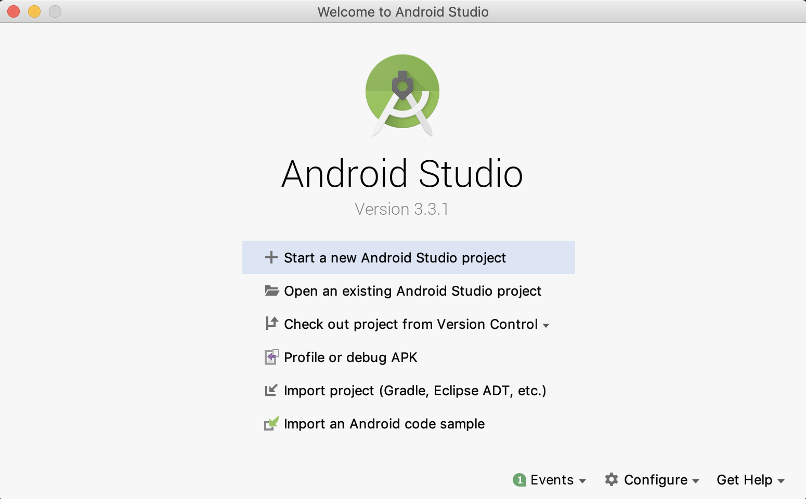
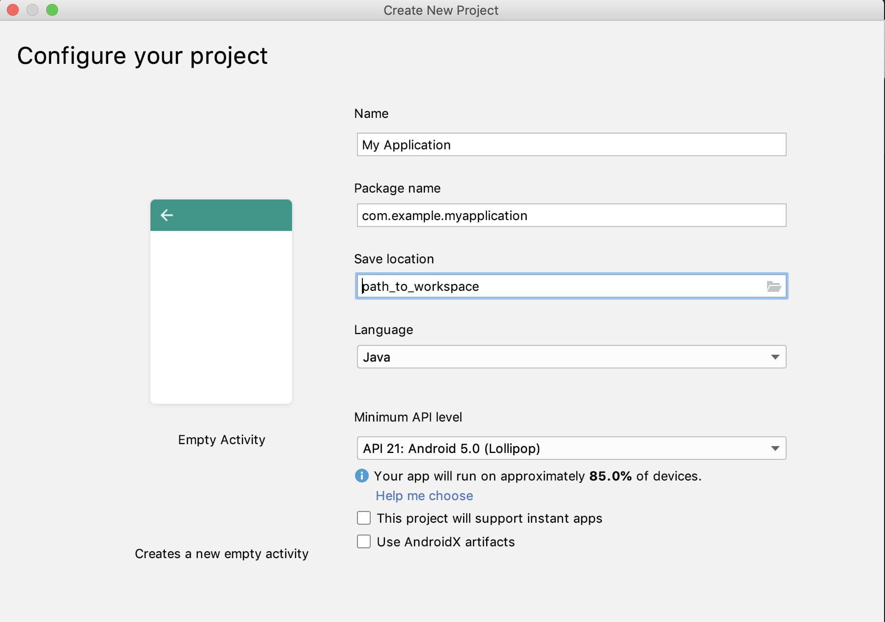
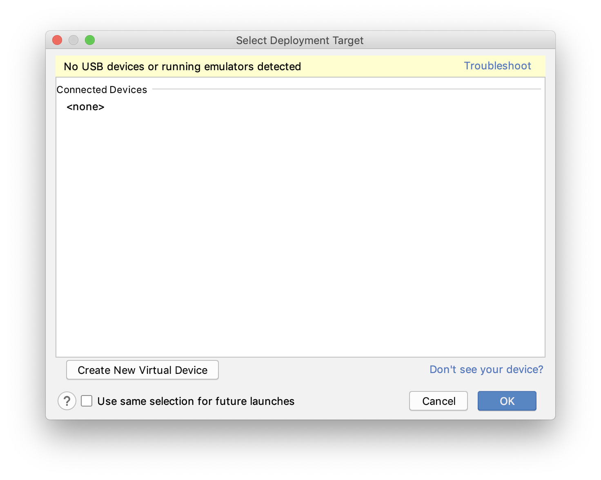
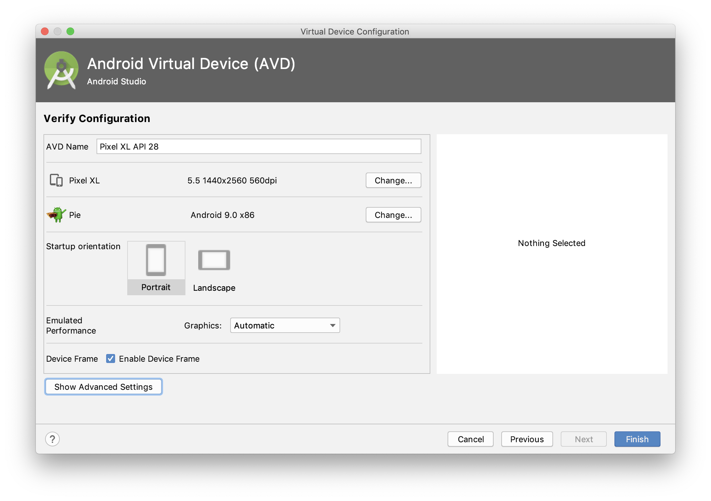

# Android

## Contents

1. [Role of `Kotlin`, `Java` and `XML` in Android](#role-of-kotlin-java-and-xml-in-android)
2. [Getting started with Android Application Development](#getting-started-with-android-application-development)
3. [Creating a new Empty Android Project](#creating-a-new-empty-android-project)
4. [Creating an emulator in Android Studio to run android apps](#creating-an-emulator-in-android-studio-to-run-android-apps)
5. [Building the UI](#building-the-ui)
6. [Android activity life cycle](#android-activity-life-cycle)
7. [List of Android app demos available in the repository](#list-of-android-app-demos-available-in-the-repository).

---

## Role of `Kotlin`, `Java` and `XML` in Android

1. `XML` (eXtensible Markup Language): `XML` is used for declaring and defining layouts in android. It can be said that `XML` defines how the UI looks like for the application you are developing. Each element in the `XML` layout has an unique 'id' which can be used to address that element from `Java` code. More on this later, in this tutorial.

2. `Kotlin`: `Koltin` is official language to develop Android applications since 2017. It is used to write the logic for the applications. This logic can control the actions that take place when user interacts with the application.

3. `Java`: Before `Kotlin` was introduced in Android mobile development, `Java` was used to write the logic for the application. Because of its long existence `Java` is still used to develop apps, but the industry is shifting towards `Kotlin`.

---

## App components

This section has been taken from the [official Android Developer Guide.](https://developer.android.com/guide/components/fundamentals?hl=en)
You may want to read in detail about the app components in the guide.

### 1. Activities

An `activity` is the entry point for interacting with the user. It represents a single screen with a user interface. For example, an email app might have one activity that shows a list of new emails, another activity to compose an email, and another activity for reading emails.

### 2. Services

A `service` is a general-purpose entry point for keeping an app running in the background for all kinds of reasons. It is a component that runs in the background to perform long-running operations or to perform work for remote processes. A `service` does not provide a user interface. For example, a `service` might play music in the background while the user is in a different app, or it might fetch data over the network without blocking user interaction with an activity.

### 3. Broadcast receivers

A `broadcast receiver` is a component that enables the system to deliver events to the app outside of a regular user flow, allowing the app to respond to system-wide broadcast announcements. Because `broadcast receivers` are another well-defined entry into the app, the system can deliver broadcasts even to apps that aren't currently running. So, for example, an app can schedule an alarm to post a notification to tell the user about an upcoming event... and by delivering that alarm to a `BroadcastReceiver` of the app, there is no need for the app to remain running until the alarm goes off. Many broadcasts originate from the system—for example, a broadcast announcing that the screen has turned off, the battery is low, or a picture was captured. Apps can also initiate broadcasts—for example, to let other apps know that some data has been downloaded to the device and is available for them to use.

### 4. Content providers

A `content provider` manages a shared set of app data that you can store in the file system, in a SQLite database, on the web, or on any other persistent storage location that your app can access. Through the `content provider`, other apps can query or modify the data if the `content provider` allows it. For example, the Android system provides a `content provider` that manages the user's contact information.

---

## Getting started with Android Application Development

1. [Download Android Studio.](https://developer.android.com/studio/index.html)
2. Follow the on-screen instructions to install Android Studio.

---

## Creating a new Empty Android Project

This is kind of `Hello World App`.
Open Android Studio, and follow the following images to create an empty project.

1. Welcome Screen of Android Studio.

2. Choose the project from the list of available templates.

3. Configure your project by specifying the project name, your workspace location, your preferred language (`Kotlin` or `Java`), minimum API level etc.

4. Give it a minute or two to build the project. (The build process can be seen on the right bottom part of Android Studio).

5. If the build was successful, you'll see the following screen without any errors:

---

## Creating an emulator in Android Studio to run android apps

If you do not have an Android phone to run the apps you develop, you can try to run them on the Emulator.
But the emulator has limited functionalities.

1. Click on the Run app button in android studio (shown below in red).

2. You must see the following dialog box.

    Click on `Create New Virtual Device`

3. In the next screen select the Android phone on which you wish to run the apps.

4. On the next screen select the android version which should be emulated.
(Download android images if they were not downloaded before)

5. In the following screen give the  emulator a name and select other configurations and click on finish.

6. Select the created emulator in the screen shown below and click on ok.

7. After the emulator is selected in previous step, a virtual Android device pops up and starts to boot. After the boot process is over you can see you app open up automatically. A Hello World app on emulator should appear similar to the image below.

---

## Building the UI

In Android Studio, UI can built using the Layout Editor, `XML` code or both.
There are many UI control elements in Android such as Buttons, Text Views, Edit Text, Image views etc.
We will learn some of the necessary elements in this tutorial.

## [Layout Editor](https://developer.android.com/studio/write/layout-editor)

Most part for Android UI for basic apps can be done using the drag and drop feature in Android Studio Layout Editor.
As apps get complex, you need to write and modify `XML` code instead of the drag and drop approach.

Palette (marked in red box) contains all the basic components that can be used to build the UI. Each component can be dragged and dropped to the Design Editor. Each component's attributes can be set and unset using the attributes control marked in green box).

---

## Android activity life cycle

The `Activity` class is a crucial component of an Android app, and the way activities are launched and put together is a fundamental part of the platform's application model. Unlike programming paradigms in which apps are launched with a main() method, the Android system initiates code in an `Activity` instance by invoking specific callback methods that correspond to specific stages of its lifecycle.

Read about Activities in Android [here.](https://developer.android.com/guide/components/activities/intro-activities)

Following image shows the various callback methods that can be implemented to perform actions during different states of an activity.

**You can use Log statements to verify this activity lifecycle. Log statements will be covered later in this tutorial**

---

## List of Android app demos available in the repository

To try the series of demos available in the repository, you need to create a new Android project for every demo. Follow these steps to create a new project:

1. To start with, first create an [Empty android project](#creating-a-new-empty-android-project).

2. After creating an empty project, you will see the Android layout has a TextView which says Hello World!

You must be able to see the `Kotlin` or `Java` and `XML` codes in the empty project.

Now you can make changes to the default empty project by writing your own code or using the code of demo apps provided below.

Following are the list of demos available in this repository. Each demo has a readme and well commented code.
(Click on the links of each demo for README)

| Demo Name | Description |||
|-------------|-------------|-------------|-------------|
|`Text Edit Demo`|Simple app with text view and edit text|[Kotlin](./kotlin_implementations/Text_Edit_Demo/README.md)|[Java](./java_implementations/Text_Edit_Demo/README.md)|
|`Fibonacci series app 1`|This app demonstrates how to display fixed length Fibonacci series generated on the app screen and using the Log statements in android |[Kotlin](./kotlin_implementations/Fib_TextView/README.md)|[Java](./java_implementations/Fib_TextView/README.md)|
|`Fibonacci series app 2`|This app demonstrates how to take length of Fibonacci series as user input in app using UI and display the generated Fibonacci series |[Kotlin](./kotlin_implementations/Fib_EditText/README.md)|[Java](./java_implementations/Fib_EditText/README.md)|
|`Text Image Demo`|Simple app with text view and image view|[Kotlin](./kotlin_implementations/Text_Image_demo/README.md)|[Java](./java_implementations/Text_Image_Demo/README.md)|
|`Slider Demo`|App to demonstrate use of slider which is called SeekBar in Android|[Kotlin](./kotlin_implementations/Slider_Demo/README.md)|[Java](./java_implementations/Slider_Demo/README.md)|
|`Sine Wave Demo 1`|App to demonstrate generating sine wave with fixed frequency|[Kotlin](./kotlin_implementations/Sine_Wave_Demo1/README.md)|[Java](./java_implementations/Sine_Wave_Demo1/README.md)|
|`Sine Wave Demo 2`|App to demonstrate generating sine wave with variable frequency (uses buttons)||[Java](./java_implementations/Sine_Wave_Demo2/README.md)|
|`Sine Wave Demo 3`|App to demonstrate generating sine wave with variable frequency (uses SeekBar)||[Java](./java_implementations/Sine_Wave_Demo3/README.md)|
|`Sine Wave Demo 4`|App to demonstrate generating sine wave with variable frequency and gain (uses SeekBar)||[Java](./java_implementations/Sine_Wave_Demo4/README.md)|
|`Accelero-Sine wave`|A fun app. The frequency of the sine wave changes as you move and rotate your phone (uses accelerometer)||[Java](./java_implementations/Accelerometer_Sine_Wave/README.md)|

---
