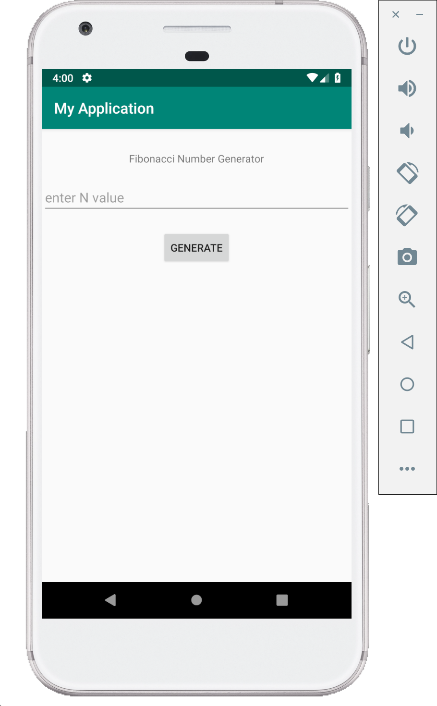

# Fibonacci series app

This demo displays fibonacci series in the the app screen as well as Logcat.
Here we do not take the user input, we directly generate the Nth Fibonacci Number for N which will be predefined in the code.
We will build on this code in next demo to take user input using Edit Text view.
This demo is based on the `Text Edit demo`.

**MainActivity.java**

```java
package com.example.fibonacciusingedittext;

import android.support.v7.app.AppCompatActivity;
import android.os.Bundle;
import android.util.Log;
import android.view.View;
import android.widget.Button;
import android.widget.EditText;
import android.widget.TextView;

import java.util.Arrays;

public class MainActivity extends AppCompatActivity {

    /* Define a TAG string which is used as TAG in log statements */
    private static final String TAG = "MyActivity";

    private EditText getN;
    private TextView fibText;

    private int N;
    private String result;

    @Override
    protected void onCreate(Bundle savedInstanceState) {
        super.onCreate(savedInstanceState);
        setContentView(R.layout.activity_main);

        /* Get the views from the layout by using the ids defined in XML */
        fibText = findViewById(R.id.text_view);
        Button genFib = findViewById(R.id.genFib);
        getN = findViewById(R.id.getN);


        /*
          set onClickListener to the button
          and write the logic for what happens when the button is clicked
         */
        genFib.setOnClickListener(new View.OnClickListener() {
            @Override
            public void onClick(View v) {

                if(!getN.getText().toString().equals("")) {

                    /* There are multiple ways to convert text to integer, this is one way */
                    N = Integer.parseInt(getN.getText().toString());

                    result = nFib(N);

                    /* Log the result */
                    Log.d(TAG, result);
                } else {
                    result = "Not a valid value";
                }

                // set the result string to the TextView
                fibText.setText(result);
            }
        });
    }

    /* a method to generate the Nth Fibonacci number */
    static String nFib(int N)
    {
        if (N > 0) {

            /* return 1 if N is 1 */
            if(N == 1){
                return "1";
            }

            /* perform calculations only if N > 1 */


            /*long is used to avoid overflow for bigger N */

            long[] result = new long[N];

            /* first two Fibonacci numbers */
            result[0] = result[1] = 1;

            /* generate the fibonacci sequence and store in the array */
            for (int i = 2; i <= N - 1; i++) {
                result[i] = result[i - 1] + result[i - 2];
            }

            for (long res : result) { /* simple way to traverse arrays */

                /* print the generated fibonacci series */
                Log.d(TAG, String.valueOf(res));

            }

            /* print last Fibonacci number to logcat with a message */
            Log.d(TAG, "The " + N + " Fibonacci number is " + result[N-1]);

            /* convert the array to string and return it */
            return Arrays.toString(result);
        }

        /* return a message if N < 0 */
        return "Not a valid value";
    }
}

```

> Here we user ScrollView to enable scrolling of the layout. If a larger value of N is used to generate the series, the values start overflowing and results become negative. Also, the values would not fit in the screen, so scroll view helps in enabling scrolling. Use the following layout code for this example.

>> The app crashes if we enter value 1 in the EditText. It throws `ArrayIndexOutOfBoundsException` exception. This exception can be seen in the Logcat. You can try to modify the code to get rid of this bug. It needs very few simple changes

**activity_main.xml**

```XML
<?xml version="1.0" encoding="utf-8"?>
<ScrollView android:id="@+id/ScrollView01"
    android:layout_width="match_parent"
    android:layout_height="match_parent"
    xmlns:android="http://schemas.android.com/apk/res/android">
    <LinearLayout
        xmlns:tools="http://schemas.android.com/tools"
        android:layout_width="match_parent"
        android:layout_height="match_parent"
        tools:context=".MainActivity"
        android:orientation="vertical"
        android:gravity="center_horizontal">

            <TextView
                android:id="@+id/text_view"
                android:layout_width="wrap_content"
                android:layout_height="wrap_content"
                android:layout_marginTop="30dp"
                android:text="Fibonacci Number Generator"/>
        <EditText
            android:id="@+id/getN"
            android:layout_width="match_parent"
            android:layout_height="wrap_content"
            android:layout_marginTop="20dp"
            android:ems="10"
            android:hint="enter N value"
            android:inputType="number"/>

        <Button
            android:id="@+id/genFib"
            android:layout_width="wrap_content"
            android:layout_height="wrap_content"
            android:layout_marginTop="20dp"
            android:text="Generate" />
    </LinearLayout>
</ScrollView>
```

## Screenshots

Following are few screenshots of this demo.




