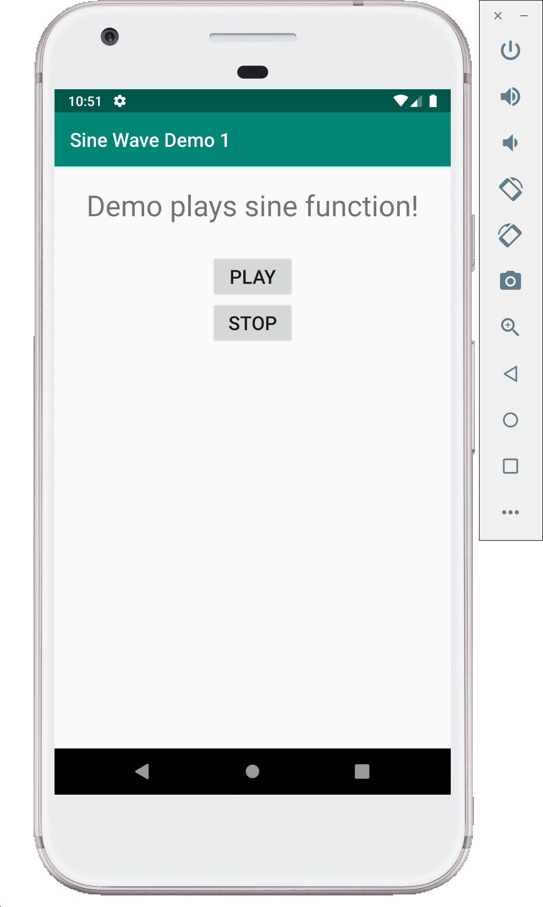

# Sine Wave demo - 1 (Java)

This is a simple demo of sine wave generation. Sine wave generation is very similar to that used in the Lab.
This demo makes use of Thread. A thread is a thread of execution in a program. The Java Virtual Machine allows an application to have multiple threads of execution running concurrently. Read more about thread [here](https://developer.android.com/guide/components/processes-and-threads) and [here](https://developer.android.com/reference/java/lang/Thread).

There are two buttons defined in the layout. `Start` button is used to start synthesizing and playing the sine wave generated and `Stop` button is used to stop the synthesis and playing the sine wave to the speaker.

Make the following changes to **MainActivity.java** and **activity_main.xml**.

```Java
package com.example.sinewavedemo1;

import android.support.v7.app.AppCompatActivity;
import android.os.Bundle;
import android.view.View;
import android.widget.Button;
import android.media.AudioTrack;
import android.media.AudioFormat;
import android.media.AudioManager;

public class MainActivity extends AppCompatActivity {

    Button PlayBtn;
    Button StopBtn;
    AudioTrack Track;
    boolean isplaying = false;
    int Fs = 44100;
    int buffLength = AudioTrack.getMinBufferSize(Fs, AudioFormat.CHANNEL_OUT_MONO, AudioFormat.ENCODING_PCM_16BIT);

    @Override
    protected void onCreate(Bundle savedInstanceState) {
        super.onCreate(savedInstanceState);
        setContentView(R.layout.activity_main);

        PlayBtn = (Button) findViewById(R.id.PlayBtn);
        PlayBtn.setOnClickListener(new View.OnClickListener() {
            @Override
            public void onClick(View view) {
                if (!isplaying) {
                    // Create a new thread to play the audio.
                    // Performing intensive operations and computations on the main UI thread,
                    // makes the app slow.
                    // That is, it is a bad idea to do intensive computations on main UI thread,
                    // so it is recommended to create a new thread to do computations in the
                    // background
                    (new Thread() {
                        @Override
                        public void run() {
                            initTrack();
                            startPlaying();
                            playback();
                        }
                    }).start();
                }

            }
        });

        StopBtn = (Button) findViewById(R.id.StopBtn);
        StopBtn.setOnClickListener(new View.OnClickListener() {
            @Override
            public void onClick(View view) {
                stopPlaying();
            }
        });
    }

    private void initTrack() {
        // Very similar to opening a stream in PyAudio
        // In Android create a AudioTrack instance and initialize it with different
        // parameters

        Track = new AudioTrack(AudioManager.MODE_NORMAL, Fs, AudioFormat.CHANNEL_OUT_MONO,
                AudioFormat.ENCODING_PCM_16BIT, buffLength, AudioTrack.MODE_STREAM);
    }

    private void startPlaying() {
        Track.play();
        isplaying = true;
    }

    private void playback() {
        // simple sine wave generator
        short[] frame_out = new short[buffLength];
        int amplitude = (int) (32767);
        int frequency = 440;
        double twopi = 8. * Math.atan(1.);
        double phase = 0.0;
        while (isplaying) {
            for (int i = 0; i < buffLength; i++) {
                frame_out[i] = (short) (amplitude * Math.sin(phase));
                phase += twopi * frequency / Fs;
                if (phase > twopi) {
                    phase -= twopi;
                }
            }
            Track.write(frame_out, 0, buffLength);
        }
    }

    private void stopPlaying() {
        if (isplaying) {
            isplaying = false;
            // Stop playing the audio data and release the resources
            Track.stop();
            Track.release();
        }
    }
}
```

```XML
<?xml version="1.0" encoding="utf-8"?>
<LinearLayout xmlns:android="http://schemas.android.com/apk/res/android"
    xmlns:app="http://schemas.android.com/apk/res-auto"
    xmlns:tools="http://schemas.android.com/tools"
    android:layout_width="match_parent"
    android:layout_height="match_parent"
    tools:context=".MainActivity"
    android:orientation="vertical"
    android:gravity="center_horizontal">

    <TextView
        android:layout_width="wrap_content"
        android:layout_height="wrap_content"
        android:layout_marginTop="20dp"
        android:text="Demo plays sine function!"
        android:textSize="30dp"
        />
    <Button
        android:id="@+id/PlayBtn"
        android:layout_width="wrap_content"
        android:layout_height="wrap_content"
        android:layout_marginTop="30dp"
        android:text="play"
        android:textSize="20dp"/>
    <Button
        android:id="@+id/StopBtn"
        android:layout_width="wrap_content"
        android:layout_height="wrap_content"
        android:text="Stop"
        android:textSize="20dp"/>
</LinearLayout>
```

## Screenshots

Following are few screenshots of this demo.


