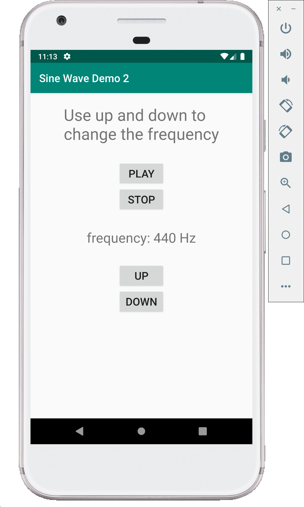

# Sine Wave Demo - 2 (Java)

This demo is very similar to the `Sine Wave Demo - 1`, the only difference in this demo is that we are able to control the frequency of the sine wave generated using two buttons. Up button is used to increase the frequency by 10 Hz and the down button is used to decrease the frequency by 10 Hz.

**MainActivity.java**

```java
package com.example.sinewavedemo2;

import android.support.v7.app.AppCompatActivity;
import android.os.Bundle;
import android.view.View;
import android.widget.Button;
import android.media.AudioTrack;
import android.media.AudioFormat;
import android.media.AudioManager;
import android.widget.TextView;

public class MainActivity extends AppCompatActivity {

    Button PlayBtn;
    Button StopBtn;
    Button UpBtn;
    Button DownBtn;
    TextView FreqDisp;
    AudioTrack Track;
    int frequency = 440;
    boolean isplaying = false;
    int Fs = 44100;
    int buffLength = AudioTrack.getMinBufferSize(Fs, AudioFormat.CHANNEL_OUT_MONO, AudioFormat.ENCODING_PCM_16BIT);

    @Override
    protected void onCreate(Bundle savedInstanceState) {
        super.onCreate(savedInstanceState);
        setContentView(R.layout.activity_main);

        FreqDisp = (TextView) findViewById(R.id.FreqDisp);

        PlayBtn = (Button) findViewById(R.id.PlayBtn);
        PlayBtn.setOnClickListener(new View.OnClickListener() {
            @Override
            public void onClick(View view) {
                if (!isplaying) {
                    (new Thread() {
                        @Override
                        public void run() {
                            initTrack();
                            startPlaying();
                            playback();
                        }
                    }).start();
                }

            }
        });

        StopBtn = (Button) findViewById(R.id.StopBtn);
        StopBtn.setOnClickListener(new View.OnClickListener() {
            @Override
            public void onClick(View view) {
                stopPlaying();
            }
        });

        // button to increase the frequency of the sine wave generated
        UpBtn = (Button) findViewById(R.id.FreqUpBtn);
        UpBtn.setOnClickListener(new View.OnClickListener() {
            @Override
            public void onClick(View view) {
                String display_msg = "Frequency: ";
                frequency = frequency + 10;
                display_msg = display_msg + frequency + " Hz";
                FreqDisp.setText(display_msg);
            }
        });

        // button to decrease the frequency of the sine wave generated
        DownBtn = (Button) findViewById(R.id.FreqDownBtn);
        DownBtn.setOnClickListener(new View.OnClickListener() {
            @Override
            public void onClick(View view) {
                String display_msg = "Frequency: ";
                frequency = frequency - 10;
                display_msg = display_msg + frequency + " Hz";
                FreqDisp.setText(display_msg);
            }
        });
    }

    private void initTrack() {

        Track = new AudioTrack(AudioManager.MODE_NORMAL, Fs, AudioFormat.CHANNEL_OUT_MONO,
                AudioFormat.ENCODING_PCM_16BIT, buffLength, AudioTrack.MODE_STREAM);
    }

    private void startPlaying() {
        Track.play();
        isplaying = true;
    }

    private void playback() {
        short[] frame_out = new short[buffLength];
        int amplitude = (int) (32767);
        double twopi = 8. * Math.atan(1.);
        double phase = 0.0;
        while (isplaying) {
            for (int i = 0; i < buffLength; i++) {
                frame_out[i] = (short) (amplitude * Math.sin(phase));
                phase += twopi * frequency / Fs;
                if (phase > twopi) {
                    phase -= twopi;
                }
            }
            Track.write(frame_out, 0, buffLength);
        }
    }

    private void stopPlaying() {
        if (isplaying) {
            isplaying = false;
            Track.stop();
            Track.release();
        }
    }
}
```

**activity_main.XML**

```XML
<?xml version="1.0" encoding="utf-8"?>
<LinearLayout xmlns:android="http://schemas.android.com/apk/res/android"
    xmlns:app="http://schemas.android.com/apk/res-auto"
    xmlns:tools="http://schemas.android.com/tools"
    android:layout_width="match_parent"
    android:layout_height="match_parent"
    tools:context=".MainActivity"
    android:gravity="center_horizontal"
    android:orientation="vertical">

    <TextView
        android:layout_width="wrap_content"
        android:layout_height="wrap_content"
        android:layout_marginTop="20dp"
        android:text="Use up and down to \nchange the frequency"
        android:textSize="30dp"
        />

    <Button
        android:id="@+id/PlayBtn"
        android:layout_width="wrap_content"
        android:layout_height="wrap_content"
        android:layout_marginTop="30dp"
        android:text="play"
        android:textSize="20dp"/>
    <Button
        android:id="@+id/StopBtn"
        android:layout_width="wrap_content"
        android:layout_height="wrap_content"
        android:text="Stop"
        android:textSize="20dp"/>

    <TextView
        android:id="@+id/FreqDisp"
        android:layout_width="wrap_content"
        android:layout_height="wrap_content"
        android:layout_marginTop="30dp"
        android:text="frequency: 440 Hz"
        android:textSize="25dp"/>

    <Button
        android:id="@+id/FreqUpBtn"
        android:layout_width="wrap_content"
        android:layout_height="wrap_content"
        android:layout_marginTop="30dp"
        android:text="Up"
        android:textSize="20dp"/>
    <Button
        android:id="@+id/FreqDownBtn"
        android:layout_width="wrap_content"
        android:layout_height="wrap_content"
        android:text="Down"
        android:textSize="20dp"/>

</LinearLayout>
```

## Screenshots

Following are few screenshots of this demo.


