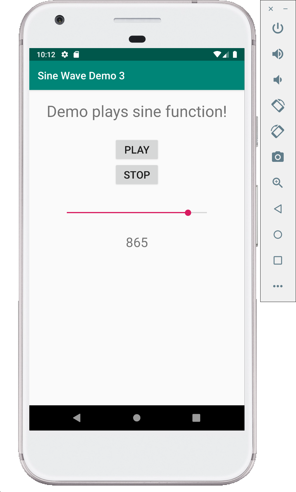

# Sine Wave Demo - 3 (Java)

This is demo is similar to `Sine Wave Demo - 2` which supported changing frequency of sine wave using Buttons.
Instead of buttons, this demo uses Slider which was used in the `Slider Demo`. Slider provides a convenient way to vary the frequency.

**MainActivity.java**

```java
import android.support.v7.app.AppCompatActivity;
import android.os.Bundle;
import android.view.View;
import android.widget.Button;
import android.media.AudioTrack;
import android.media.AudioFormat;
import android.media.AudioManager;
import android.widget.SeekBar;
import android.widget.TextView;

public class MainActivity extends AppCompatActivity {

    Button PlayBtn;
    Button StopBtn;
    SeekBar FreqSlider;
    TextView FreqDisp;
    AudioTrack Track;
    boolean isplaying = false;
    int Fs = 44100;
    int frequency = 500;
    int  buffLength = AudioTrack.getMinBufferSize(Fs, AudioFormat.CHANNEL_OUT_MONO, AudioFormat.ENCODING_PCM_16BIT);

    @Override
    protected void onCreate(Bundle savedInstanceState) {
        super.onCreate(savedInstanceState);
        setContentView(R.layout.activity_main);

        PlayBtn = (Button) findViewById(R.id.PlayBtn);
        PlayBtn.setOnClickListener(new View.OnClickListener() {
            @Override
            public void onClick(View view) {
                if (!isplaying){
                    (new Thread() {
                        @Override
                        public void run() {
                            initTrack();
                            startPlaying();
                            playback();
                        }
                    }).start();
                }

            }
        });

        StopBtn = (Button) findViewById(R.id.StopBtn);
        StopBtn.setOnClickListener(new View.OnClickListener() {
            @Override
            public void onClick(View view) {
                stopPlaying();
            }
        });

        FreqDisp = (TextView) findViewById(R.id.FreqDisp);
        FreqSlider = (SeekBar) findViewById(R.id.FreqSlider);
        FreqSlider.setOnSeekBarChangeListener(new SeekBar.OnSeekBarChangeListener() {
            @Override
            public void onProgressChanged(SeekBar seekBar, int i, boolean b) {
                String disp_msg="";
                frequency = i;
                disp_msg +=frequency;
                FreqDisp.setText(disp_msg);
            }

            @Override
            public void onStartTrackingTouch(SeekBar seekBar) {

            }

            @Override
            public void onStopTrackingTouch(SeekBar seekBar) {

            }
        });
    }

    private void initTrack(){

        Track = new AudioTrack(AudioManager.MODE_NORMAL,
                Fs,
                AudioFormat.CHANNEL_OUT_MONO,
                AudioFormat.ENCODING_PCM_16BIT,
                buffLength,
                AudioTrack.MODE_STREAM);
    }

    private void startPlaying(){
        Track.play();
        isplaying=true;
    }

    private void playback(){
        short[] frame_out= new short[buffLength];
        int amplitude = (int) (32767) ;
        double twopi = 8. * Math.atan(1.);
        double phase = 0.0;
        while (isplaying){
            for (int i = 0; i < buffLength; i++) {
                frame_out[i] = (short) (amplitude * Math.sin(phase));
                phase += twopi * frequency / Fs;
                if (phase>twopi){
                    phase -= twopi;
                }
            }
            Track.write(frame_out, 0, buffLength);
        }
    }

    private void stopPlaying(){
        if (isplaying){
            isplaying=false;
            Track.stop();
            Track.release();
        }
    }
}
```

**activity_main.XML**

```xml
<?xml version="1.0" encoding="utf-8"?>
<LinearLayout xmlns:android="http://schemas.android.com/apk/res/android"
    xmlns:app="http://schemas.android.com/apk/res-auto"
    xmlns:tools="http://schemas.android.com/tools"
    android:layout_width="match_parent"
    android:layout_height="match_parent"
    tools:context=".MainActivity"
    android:gravity="center_horizontal"
    android:orientation="vertical">

    <TextView
        android:layout_width="wrap_content"
        android:layout_height="wrap_content"
        android:layout_marginTop="20dp"
        android:text="Demo plays sine function!"
        android:textSize="30dp"
        />
    <Button
        android:id="@+id/PlayBtn"
        android:layout_width="wrap_content"
        android:layout_height="wrap_content"
        android:layout_marginTop="30dp"
        android:text="play"
        android:textSize="20dp"/>
    <Button
        android:id="@+id/StopBtn"
        android:layout_width="wrap_content"
        android:layout_height="wrap_content"
        android:text="Stop"
        android:textSize="20dp"/>

    <SeekBar
        android:id="@+id/FreqSlider"
        android:layout_width="300dp"
        android:layout_height="wrap_content"
        android:layout_marginTop="40dp"
        android:progress="500"
        android:max="1000"
        />

    <TextView
        android:id="@+id/FreqDisp"
        android:layout_width="wrap_content"
        android:layout_height="wrap_content"
        android:layout_marginTop="30dp"
        android:text="500"
        android:textSize="25dp"/>

</LinearLayout>
```

## Screenshots

Following are few screenshots of this demo.

