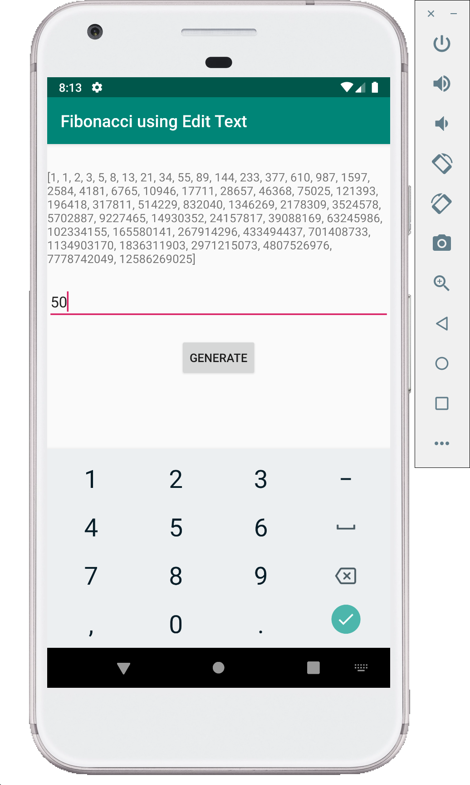

# Fibonacci series app (Kotlin)

This demo displays fibonacci series in the the app screen as well as Logcat.
Here we do not take the user input, we directly generate the Nth Fibonacci Number for N which will be predefined in the code.
We will build on this code in next demo to take user input using Edit Text view.
This demo is based on the `Text Edit demo`.

**MainActivity.kt**

```kotlin
package com.example.fibonacciusingedittext

import android.support.v7.app.AppCompatActivity
import android.os.Bundle
import android.util.Log
import android.widget.Button
import android.widget.EditText
import android.widget.TextView
import java.util.*

class MainActivity : AppCompatActivity() {

    // Define a TAG string which is used as TAG in log statements
    private val TAG: String = "MyActivity"

    override fun onCreate(savedInstanceState: Bundle?) {
        super.onCreate(savedInstanceState)
        setContentView(R.layout.activity_main)

        // create an instances of TextView, EditText and Button views
        val fibText: TextView = findViewById(R.id.text_view)
        val getN: EditText = findViewById(R.id.getN)
        val genFib: Button = findViewById(R.id.genFib)

        /*
         * set onClickListener to the button and write the logic for what happens when
         * the button is clicked
         */
        genFib.setOnClickListener {
            // if the edit text is not empty,
            // generate the fibonacci series and display it on the screen
            if (getN.text.isNotEmpty()) {
                val N: Int = getN.text.toString().toInt()
                fibText.text = nFib(N)
            } else {
                fibText.text = "Not a valid value"
            }
        }
    }

    private fun nFib(N: Int): String {
        if (N > 0) {
            val result = LongArray(N) // long is used to avoid overflow for bigger N
            result[1] = 1
            result[0] = result[1] // first two Fibonacci numbers

            // generate the fibonacci sequence and store in the array
            for (i in 2 until N) {
                // the for statement can also be written as
                // for (i in 2 until N)
                result[i] = result[i - 1] + result[i - 2]
            }

            for (res in result) { // simple way to traverse arrays

                // print the generated fibonacci series
                Log.d(TAG, res.toString())

            }

            // print last Fibonacci number to logcat with a message
            Log.d(TAG, "The 15th Fibonacci number is " + result[N - 1])

            return Arrays.toString(result) // convert the array to string and return it
        } else {
            return "Not a valid value of N" // return a message if N < 0
        }
    }
}
```

> Here we user ScrollView to enable scrolling of the layout. If a larger value of N is used to generate the series, the values start overflowing and results become negative. Also, the values would not fit in the screen, so scroll view helps in enabling scrolling. Use the following layout code for this example.

> The app crashes if we enter value 1 in the EditText. It throws `ArrayIndexOutOfBoundsException` exception. This exception can be seen in the Logcat. You can try to modify the code to get rid of this bug. It needs very few simple changes

**activity_main.java**

```XML
<?xml version="1.0" encoding="utf-8"?>
<ScrollView android:id="@+id/ScrollView01"
    android:layout_width="match_parent"
    android:layout_height="match_parent"
    xmlns:android="http://schemas.android.com/apk/res/android">
    <LinearLayout
        xmlns:tools="http://schemas.android.com/tools"
        android:layout_width="match_parent"
        android:layout_height="match_parent"
        tools:context=".MainActivity"
        android:orientation="vertical"
        android:gravity="center_horizontal">

            <TextView
                android:id="@+id/text_view"
                android:layout_width="wrap_content"
                android:layout_height="wrap_content"
                android:layout_marginTop="30dp"
                android:text="Fibonacci Number Generator"/>
        <EditText
            android:id="@+id/getN"
            android:layout_width="match_parent"
            android:layout_height="wrap_content"
            android:layout_marginTop="20dp"
            android:ems="10"
            android:hint="enter N value"
            android:inputType="number"/>

        <Button
            android:id="@+id/genFib"
            android:layout_width="wrap_content"
            android:layout_height="wrap_content"
            android:layout_marginTop="20dp"
            android:text="Generate" />
    </LinearLayout>
</ScrollView>
```

## Screenshots

Following are few screenshots of this demo.



