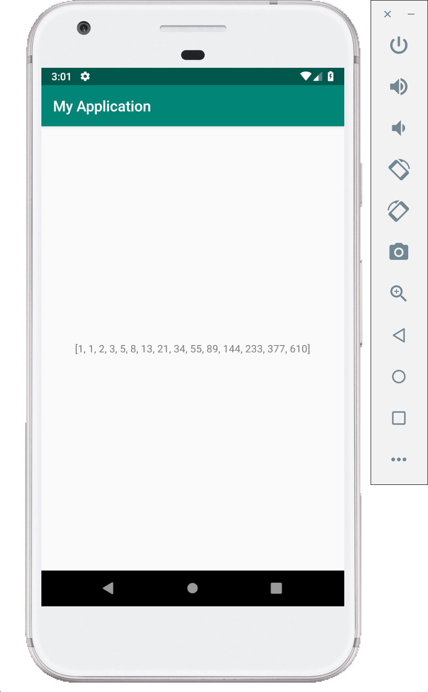

# Fibonacci series app (Kotlin)

This demo displays fibonacci series in the the app screen as well as Logcat.
Here we do not take the user input, we directly generate the Nth Fibonacci Number for N which will be predefined in the code.
We will build on this code in next demo to take user input using Edit Text view.

(In the following kotlin code you can see that we reuse the fibonacci function we wrote previously in Kotlin basics.)

Make the following changes to **MainActivity.kt** and **activity_main.xml**.

## MainActivity.kt

```kotlin
package com.example.fibonaccitextview

import android.support.v7.app.AppCompatActivity
import android.os.Bundle
import android.util.Log
import android.widget.TextView
import java.util.*

class MainActivity : AppCompatActivity() {

    // Define a TAG string which is used as TAG in log statements
    private val TAG: String = "MyActivity"

    override fun onCreate(savedInstanceState: Bundle?) {
        super.onCreate(savedInstanceState)
        setContentView(R.layout.activity_main)

        val N = 15

        // create an instance of TextView
        val fibText: TextView = findViewById(R.id.text_view)

        fibText.text = nFib(N)

    }

    private fun nFib(N: Int): String {
        if (N > 0) {
            val result = LongArray(N) // long is used to avoid overflow for bigger N
            result[1] = 1
            result[0] = result[1] // first two Fibonacci numbers

            // generate the fibonacci sequence and store in the array
            for (i in 2 until N) {
                // the for statement can also be written as
                // for (i in 2 until N)
                result[i] = result[i - 1] + result[i - 2]
            }

            for (res in result) { // simple way to traverse arrays

                // print the generated fibonacci series
                Log.d(TAG, res.toString())

            }

            // print last Fibonacci number to logcat with a message
            Log.d(TAG, "The 15th Fibonacci number is " + result[N - 1])

            return Arrays.toString(result) // convert the array to string and return it
        } else {
            return "Not a valid value of N" // return a message if N < 0
        }
    }
}

```

## activity_main.xml

```xml
<?xml version="1.0" encoding="utf-8"?>
<LinearLayout xmlns:android="http://schemas.android.com/apk/res/android"
    xmlns:tools="http://schemas.android.com/tools"
    android:layout_width="match_parent"
    android:layout_height="match_parent"
    tools:context=".MainActivity"
    android:gravity="center_horizontal">

    <TextView
        android:id="@+id/text_view"
        android:layout_width="match_parent"
        android:layout_height="match_parent"
        android:text="Hello World!"
        android:gravity="center"/>

</LinearLayout>
```

## How to look into Logcat for the Fibonacci series which was logged by the app

After running the Fibonacci app, open Logcat which can be located at the bottom bar of the Android studio.

> The reason the demo uses Logcat is because the errors in the App are displayed in the logs and it is important to learn on how to read the logs and debug the app. Adding your own log statements helps in app make debugging easier.

[Read more about log utility here.](https://developer.android.com/reference/android/util/Log)

A particular category of logs can be seen in Logcat by selecting the category beside the search bar.
Following image shows how to use Logcat.


You can search for the specific debug messages by searching for the TAG strings which are used in the Log statements.
An example to search for the Fibonacci sequence logged is as follows:


There is a demo explaining how to debug an app which is crashing by looking into logcat.

## Screenshots

Following are few screenshots of this demo.


