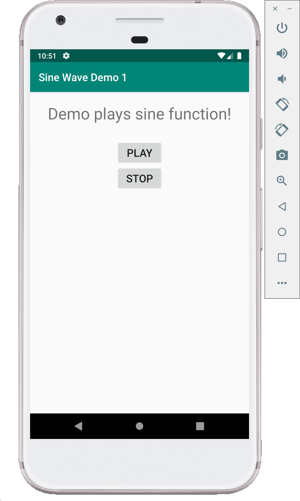

# Sine Wave demo - 1 (Kotlin)

This is a simple demo of sine wave generation. Sine wave generation is very similar to that used in the Lab.
This demo makes use of Thread. A thread is a thread of execution in a program. The Java Virtual Machine allows an application to have multiple threads of execution running concurrently. Read more about thread [here](https://kotlinlang.org/api/latest/jvm/stdlib/kotlin.concurrent/thread.html).

There are two buttons defined in the layout. `Start` button is used to start synthesizing and playing the sine wave generated and `Stop` button is used to stop the synthesis and playing the sine wave to the speaker.

Make the following changes to **MainActivity.kt** and **activity_main.xml**.

```kotlin
package com.example.sinewavedemo1

import android.media.AudioFormat
import android.media.AudioManager
import android.media.AudioTrack
import android.support.v7.app.AppCompatActivity
import android.os.Bundle
import android.widget.Button


class MainActivity : AppCompatActivity() {

    // Kotlin does not allow properties and variables of a class to be uninitialized
    // So use lateinit keyword to initialize the variables later on
    lateinit var Track: AudioTrack

    var isPlaying: Boolean = false

    val Fs: Int = 44100

    val buffLength: Int = AudioTrack.getMinBufferSize(Fs, AudioFormat.CHANNEL_OUT_MONO, AudioFormat.ENCODING_PCM_16BIT)


    override fun onCreate(savedInstanceState: Bundle?) {
        super.onCreate(savedInstanceState)
        setContentView(R.layout.activity_main)

        val playBtn: Button = findViewById(R.id.PlayBtn)

        playBtn.setOnClickListener {
            if (!isPlaying) {
                // Create a new thread to play the audio.

                // Performing intensive operations and computations on the main UI thread,
                // makes the app slow.

                // That is, it is a bad idea to do intensive computations on main UI thread,
                // so it is recommended to create a new thread to do computations in the background

                Thread {
                    initTrack()
                    startPlaying()
                    playback()
                }.start()
            }
        }

        val stopBtn: Button = findViewById(R.id.StopBtn)

        stopBtn.setOnClickListener {
            stopPlaying()
        }
    }

    private fun initTrack() {
        // Very similar to opening a stream in PyAudio
        // In Android create a AudioTrack instance and initialize it with different parameters

        // AudioTrack is deprecated for some android versions
        // Please look up for other alternatives if this does not work
        Track = AudioTrack(
            AudioManager.MODE_NORMAL, Fs, AudioFormat.CHANNEL_OUT_MONO,
            AudioFormat.ENCODING_PCM_16BIT, buffLength, AudioTrack.MODE_STREAM
        )
    }

    private fun playback() {
        // simple sine wave generator
        val frame_out: ShortArray = ShortArray(buffLength)
        val amplitude: Int = 32767
        val frequency: Int = 440
        val twopi: Double = 8.0 * Math.atan(1.0)
        var phase: Double = 0.0

        while (isPlaying) {
            for (i in 0 until buffLength) {
                frame_out[i] = (amplitude * Math.sin(phase)).toShort()
                phase += twopi * frequency / Fs
                if (phase > twopi) {
                    phase -= twopi
                }
            }
            Track.write(frame_out, 0, buffLength)
        }
    }

    private fun startPlaying() {
        Track.play()
        isPlaying = true
    }

    private fun stopPlaying() {
        if (isPlaying) {
            isPlaying = false
            // Stop playing the audio data and release the resources
            Track.stop()
            Track.release()
        }
    }

}

```

```XML
<?xml version="1.0" encoding="utf-8"?>
<LinearLayout xmlns:android="http://schemas.android.com/apk/res/android"
    xmlns:app="http://schemas.android.com/apk/res-auto"
    xmlns:tools="http://schemas.android.com/tools"
    android:layout_width="match_parent"
    android:layout_height="match_parent"
    tools:context=".MainActivity"
    android:orientation="vertical"
    android:gravity="center_horizontal">

    <TextView
        android:layout_width="wrap_content"
        android:layout_height="wrap_content"
        android:layout_marginTop="20dp"
        android:text="Demo plays sine function!"
        android:textSize="30dp"
        />
    <Button
        android:id="@+id/PlayBtn"
        android:layout_width="wrap_content"
        android:layout_height="wrap_content"
        android:layout_marginTop="30dp"
        android:text="play"
        android:textSize="20dp"/>
    <Button
        android:id="@+id/StopBtn"
        android:layout_width="wrap_content"
        android:layout_height="wrap_content"
        android:text="Stop"
        android:textSize="20dp"/>
</LinearLayout>
```

## Screenshots

Following are few screenshots of this demo.


