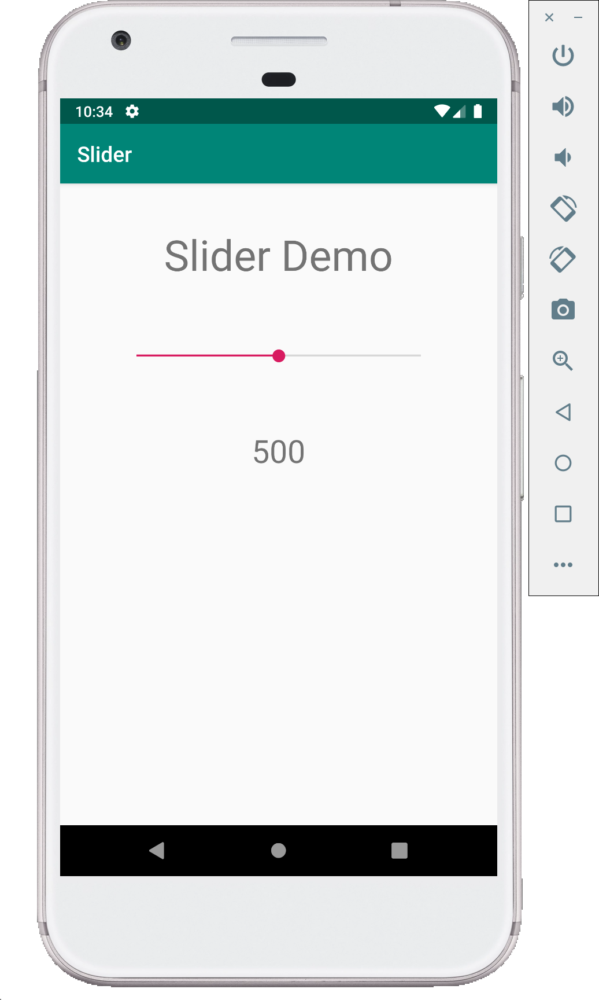
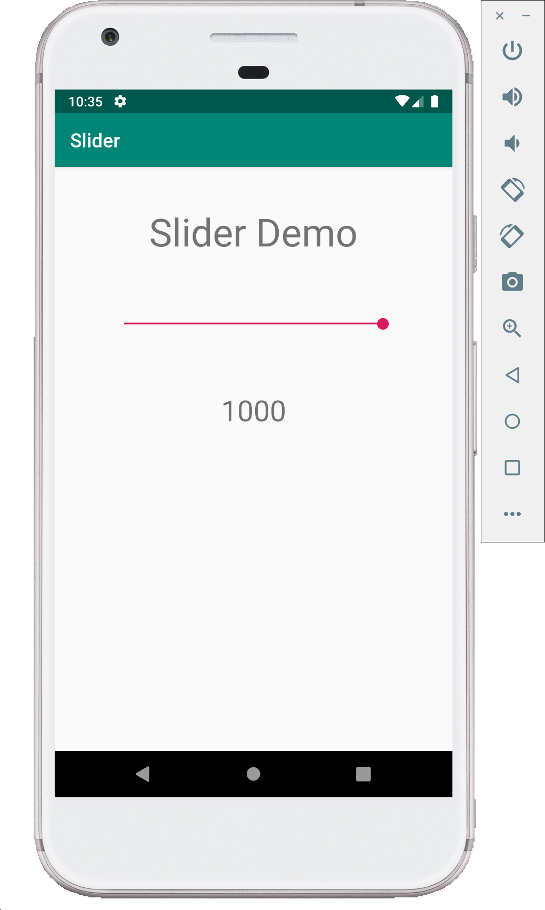

# Slider Demo (Kotlin)

This Demo introduces new widget called `SeekBar`. The Seek bar is nothing but a horizontal bar which can be used to adjust values. For example it can be used to adjust volume, frequency etc.

Make the following changes to **MainActivity.kt** and **activity_main.xml**.

**MainActivity.kt**

```kotlin
package com.example.sliderdemo

import android.support.v7.app.AppCompatActivity
import android.os.Bundle
import android.widget.SeekBar
import android.widget.TextView

class MainActivity : AppCompatActivity() {

    override fun onCreate(savedInstanceState: Bundle?) {
        super.onCreate(savedInstanceState)
        setContentView(R.layout.activity_main)
        initializeView()
    }

    private fun initializeView() {
        // create objects of TextView and Seekbar
        val sliderValue: TextView = findViewById(R.id.number_viewer)
        val slider: SeekBar = findViewById(R.id.DemoSlider)

        // set the max value of the slider using setMax function
        slider.max = 1000

        slider.setOnSeekBarChangeListener(object : SeekBar.OnSeekBarChangeListener {
            // override the onProgressChanged method to perform operations
            // whenever the there a change in SeekBar
            override fun onProgressChanged(seekBar: SeekBar?, progress: Int, fromUser: Boolean) {
                sliderValue.text = progress.toString()
            }

            override fun onStartTrackingTouch(seekBar: SeekBar?) {
            }

            override fun onStopTrackingTouch(seekBar: SeekBar?) {
            }
        })
    }
}

```

**activity_main.xml**

```xml
<?xml version="1.0" encoding="utf-8"?>
<LinearLayout xmlns:android="http://schemas.android.com/apk/res/android"
              xmlns:app="http://schemas.android.com/apk/res-auto"
              xmlns:tools="http://schemas.android.com/tools"
              android:layout_width="match_parent"
              android:layout_height="match_parent"
              tools:context=".MainActivity"
              android:orientation="vertical"
              android:gravity="center_horizontal">
    <!-- Inserting a text viewer object -->
    <TextView
            android:layout_width="wrap_content"
            android:layout_height="wrap_content"
            android:layout_marginTop="40dp"
            android:text="Slider Demo 1"
            android:textSize="40dp"
    />
    <SeekBar
            android:id="@+id/DemoSlider"
            android:layout_width="300dp"
            android:layout_height="wrap_content"
            android:layout_marginTop="60dp"
            android:max="1000"
            android:progress="500"
    />
    <TextView
            android:id="@+id/number_viewer"
            android:layout_width="wrap_content"
            android:layout_height="wrap_content"
            android:layout_marginTop="60dp"
            android:text="500"
            android:textSize="30dp"/>
</LinearLayout>
```

## Screenshots

Following are few screenshots of this demo.




