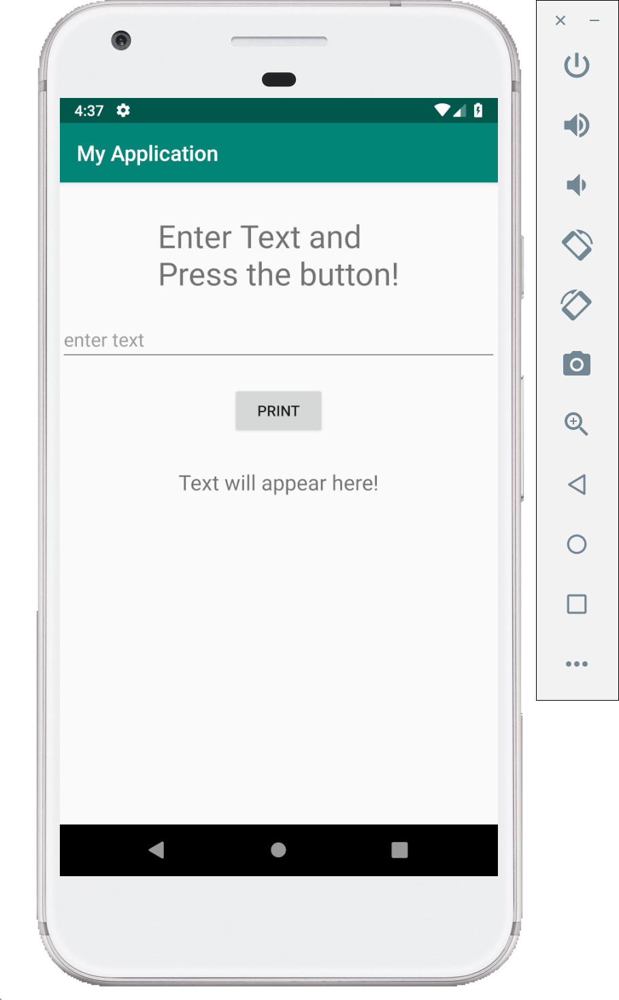
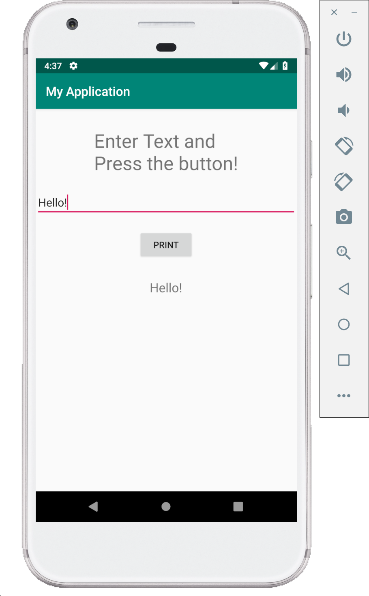

# Text Edit demo (Kotlin)

This is a simple demo which involves two text views, edit text and a button. On clicking the button, text is extracted from the edit text box and displayed in the text view.

Comments have been provided to explain the code.

**MainActivity.kt**

```kotlin
/* change the package name to the package name of you project
* errors will be thrown if package name does not match your project name
* If you had created an empty project, the default project name will be 'My Application'
* therefore, in that case the package name would be com.example.myapplication
* In this demo I created the project named TextEdit, so the
* package name is com.example.textedit
**/
package com.example.textedit

import android.support.v7.app.AppCompatActivity
import android.os.Bundle
import android.widget.Button
import android.widget.EditText
import android.widget.TextView

class MainActivity : AppCompatActivity() {

    override fun onCreate(savedInstanceState: Bundle?) {
        super.onCreate(savedInstanceState)
        setContentView(R.layout.activity_main)

        // create variables of the view elements from the layout
        val TextInput: EditText = findViewById(R.id.etText)
        val TextOutput: TextView = findViewById(R.id.PrintText)
        val writebtn: Button = findViewById(R.id.write_btn)

        // set on click listener to the button
        writebtn.setOnClickListener {
            // obtain the text from the edit text and set it to the text view
            TextOutput.text = TextInput.text
        }
    }
}
```

**activity_main.XML**

Each component of the UI can be assigned attributes such as the layout_width, layout_height etc. using the `XML` code instead of using the drag and drop feature. This method provides more flexibility and control over how the components are placed in the UI as compared to the drag and drop.

```XML
<?xml version="1.0" encoding="utf-8"?>
<LinearLayout xmlns:android="http://schemas.android.com/apk/res/android"
    xmlns:app="http://schemas.android.com/apk/res-auto"
    xmlns:tools="http://schemas.android.com/tools"
    android:layout_width="match_parent"
    android:layout_height="match_parent"
    tools:context=".MainActivity"
    android:orientation="vertical"
    android:gravity="center_horizontal">

    <TextView
        android:layout_width="wrap_content"
        android:layout_height="wrap_content"
        android:layout_marginTop="30dp"
        android:text="Enter Text and \nPress the button!"
        android:textSize="30dp" />
    <EditText
        android:id="@+id/etText"
        android:layout_width="match_parent"
        android:layout_height="wrap_content"
        android:layout_marginTop="20dp"
        android:ems="10"
        android:hint="enter text" >
    </EditText>

    <Button
        android:id="@+id/write_btn"
        android:layout_width="wrap_content"
        android:layout_height="wrap_content"
        android:layout_marginTop="20dp"
        android:text="Print"
        />
    <TextView
        android:id="@+id/PrintText"
        android:layout_width="wrap_content"
        android:layout_height="wrap_content"
        android:layout_marginTop="30dp"
        android:text="Text will appear here!"
        android:textSize="20dp"
        />
</LinearLayout>
```

## Screenshots

Following are few screenshots of this demo.




