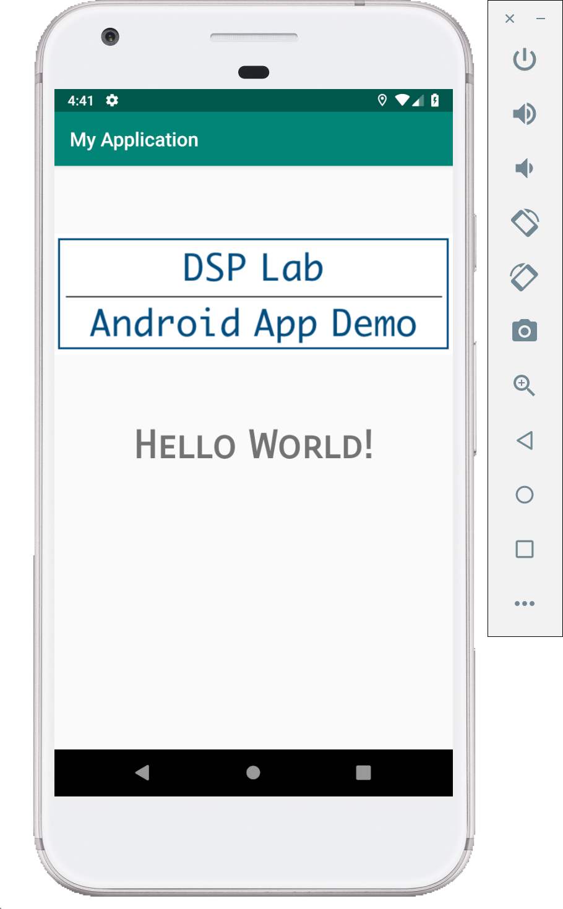

# Text and Image Demo (Kotlin)

For this demo you need to copy an image into the drawable folder of the project.
You can either navigate to the path `/<project_root>/<project_name>/app/src/main/res/drawable` using Finder/File Explorer or in Android Studio project navigator expand `app --> res --> drawable` and right click on drawable and click on Reveal in Finder or File explorer.

Once drawable folder is opened, paste an image of your choice with name `image.png`.

After you have an image in the drawable folder, use the following code to build this app.

There are no changes to be made to the `MainActivity.kt` file.

**MainActivity.kt**

```kotlin
package com.example.textimage

// as you write the code, these imports are most of the times made by the IDE
import android.support.v7.app.AppCompatActivity
import android.os.Bundle

class MainActivity : AppCompatActivity() {

    override fun onCreate(savedInstanceState: Bundle?) {
        super.onCreate(savedInstanceState)
        // set the
        setContentView(R.layout.activity_main)
    }
}
```

Modify the default layout file to the following code.

**activity_main.XML**

```XML
<?xml version="1.0" encoding="utf-8"?>
<LinearLayout xmlns:android="http://schemas.android.com/apk/res/android"
    xmlns:app="http://schemas.android.com/apk/res-auto"
    xmlns:tools="http://schemas.android.com/tools"
    android:layout_width="match_parent"
    android:layout_height="match_parent"
    tools:context=".MainActivity"
    android:orientation="vertical"
    android:gravity="center_horizontal">

    <ImageView
        android:layout_width="wrap_content"
        android:layout_height="wrap_content"
        android:layout_marginTop="40dp"
        android:src="@drawable/image"/>

    <TextView
        android:layout_width="wrap_content"
        android:layout_height="wrap_content"
        android:layout_marginTop="40dp"
        android:text="Hello World!"
        android:textSize="40dp"
        android:textStyle="bold"
        android:fontFamily="sans-serif-smallcaps"/>
</LinearLayout>
```

## Screenshots

Following are few screenshots of this demo.


