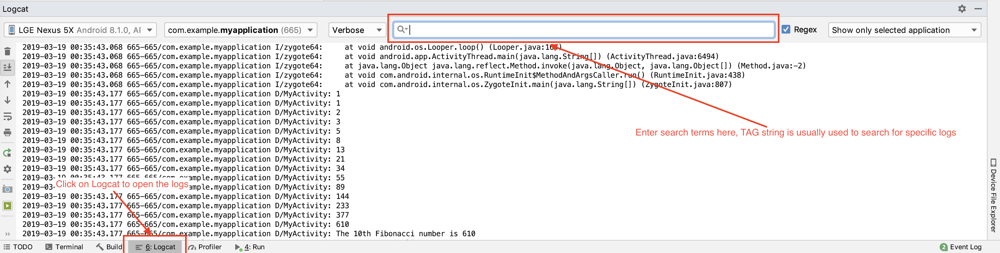
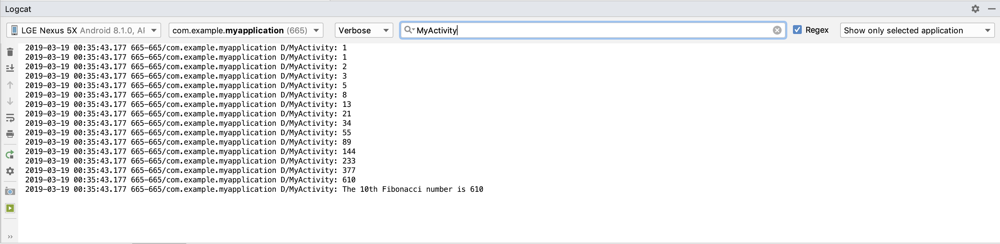

# Java basics

This section provides basics of Java so that you can understand how to write logic for the Android applications.

\* If you do not have Java installed on your machine you can download it from this [link](https://www.java.com/en/download/help/download_options.xml) and install.

\* To check is Java is already installed on your system, go to command terminal/command prompt in your system and type `java -version`. You must be able to see Java version. Or you can follow this [official link](https://www.java.com/en/download/installed.jsp) to verify Java online.

[Java](https://en.wikipedia.org/wiki/Java_(programming_language)) is a general-purpose computer-programming language that is concurrent, class-based, object-oriented, and specifically designed to have as few implementation dependencies as possible. It is intended to let application developers "write once, run anywhere" (WORA), meaning that compiled Java code can run on all platforms that support Java without the need for recompilation.

Have a look at primitive data types in Java [here.](https://docs.oracle.com/javase/tutorial/java/nutsandbolts/datatypes.html)

[Official Java tutorial by Oracle.](https://docs.oracle.com/javase/tutorial/java/index.html)

## Hello world!

```java
public class Hello // create a class called as Hello
// In Java every line of code has to be inside a class
{

    public static void main(String[] args) // entry point to program
    // just like main() in C
    {
        System.out.println("Hello world!"); // print hello world to console
    }
}
```

\* Even though the above code seems to be pretty straight forward at first look, you might want to learn meaning of each of the keywords used in the code above at this [link](https://www.learnjavaonline.org/en/Hello%2C_World%21).

To execute above code,

1. Create a java file named `Hello.java`. The class name and the file name should match. You could also download this repository and use the files provided.
2. Open terminal/command prompt and navigate to the directory which has the java program file. (You can also use any online IDEs or download one).
3. Execute `javac Hello.java` to compile the program.
4. Execute `java Hello` to run the program.

So to summarize, use `javac ClassName.java` to compile a java file, the run the program using `java ClassName`.

---

## Print Nth Fibonacci number using Java

This code demonstrates usage of loops and functions in Java.
This demo takes user input.

```java
import java.util.Scanner; // import packages

public class fib {
    // We want to generate following fibonacci series
    // 1 1 2 3 5 8 13 21 34 55 89 144 ...

    // write a method to generate the Nth Fibonacci number
    private static long nFib(int N) // note the private keyword which says
                            // only the members of the class 'fib'
                            // can access this function
    {
        if (N < 0) {
            return -1; // return -1 if N is negative
        } else if (N == 0 || N == 1 || N == 2) {
            return 1;
        } else {
            long result[] = new long[N]; // long is used to avoid overflow for bigger N
            result[0] = result[1] = 1; // first two Fibonacci numbers

            // generate the fibonacci sequence and store in the array
            for (int i = 2; i <= N - 1; i++) {
                result[i] = result[i - 1] + result[i - 2];
            }

            for (long res : result) // simple way to traverse arrays
                System.out.print(res + "\t"); // print the generated fibonacci series

            return result[N - 1]; // return the nth Fibonacci number
        }
    }

    public static void main(String args[]) {

        Scanner scanner = new Scanner(System.in); // create a scanner object
        System.out.print("Enter the the value of N: ");
        String input = scanner.nextLine(); // input can be read and string form command line
        // reading input as string just to demonstrate conversion of string to int
        // and exception handling in Java
        // following line can be used to get int input from command line
        // int input = scanner.nextInt();
        int N = 0;
        try {
            N = Integer.valueOf(input); // type casting string to int
            System.out.printf("\nThe Fibonacci number at N=%d is %d%n", N, nFib(N));
        } catch (Exception e) { // handle the errors here
            // may be ask for user input again here
            e.printStackTrace(); // print the error that occured
        } finally { // this section is always executed whether exception occurs or not
            scanner.close();
        }

    }
}
```

The syntax of Java is similar to C or C++.

(With some changes to above Java codes, they can be used in Android!
But in case of Android App, it is not preferred to use `System.out.print` statements.
Instead we use Log to generate logs in Android App.
Log statements are used while debugging Android Applications. We will deal with Logs in android later in this tutorial)

## Rewriting above Nth Fibonacci number using class in Java

This demo will help you knowing creating user defined classes in one file and use them in another file.
Informally, you have to create two separate Java files for this demo.
You can find these files in the folder [fib_in_class](./fib_in_class). To keep the demo simple and within the scope of this tutorial, we will create both files in the same directory which avoids us from worrying about creating user defined packages, interfaces etc... If you are interested you may look into Java documentation by Oracle.

First create a **fibClass.java** file. You may use the following code or use the files from [here](./fib_in_class)

```java
public class fibClass {
    // We want to generate following fibonacci series
    // 1 1 2 3 5 8 13 21 34 55 89 144 ...

    // write a method to generate the Nth Fibonacci number
    static long nFib(int N) // note the private keyword which says
                            // only the members of the class 'fib'
                            // can access this function
    {
        if (N < 0) {
            return -1; // return -1 if N is negative
        } else if (N == 0 || N == 1 || N == 2) {
            return 1;
        } else {
            long result[] = new long[N]; // long is used to avoid overflow for bigger N
            result[0] = result[1] = 1; // first two Fibonacci numbers

            // generate the fibonacci sequence and store in the array
            for (int i = 2; i <= N - 1; i++) {
                result[i] = result[i - 1] + result[i - 2];
            }

            for (long res : result) // simple way to traverse arrays
                System.out.print(res + "\t"); // print the generated fibonacci series

            return result[N - 1]; // return the nth Fibonacci number
        }
    }
}
```

Then create the **mainClass.java** file as follows in which you will try to access the `fib` method from the `fibClass`.

```java
import java.util.Scanner; // import packages

public class mainClass {
    public static void main(String args[]) {
        // fibClass fib = fibClass();
        Scanner scanner = new Scanner(System.in); // create a scanner object
        System.out.print("Enter the the value of N: ");
        String input = scanner.nextLine(); // input can be read and string form command line
        // reading input as string just to demonstrate conversion of string to int
        // and exception handling in Java
        // following line can be used to get int input from command line
        // int input = scanner.nextInt();
        int N = 0;
        try {
            N = Integer.valueOf(input); // type casting string to int
            System.out.printf("\nThe Fibonacci number at N=%d is %d%n", N, fibClass.nFib(N)); // access the method like this
            // you may try to experiment by making the nFib method private 
        } catch (Exception e) { // handle the errors here
            // may be ask for user input again here
            e.printStackTrace(); // print the error that occured
        } finally { // this section is always executed whether exception occurs or not
            scanner.close();
        }

    }
}
```

## Using constructors to create class objects in Java

In the last demo it was only a method in a class. This demo will help you to get to know about creating objects of a class.
Detailed information about classes and objects [here](https://docs.oracle.com/javase/tutorial/java/javaOO/index.html)

For this demo we will implement student records using classes.

// TODO

## Java in Android Development

From this section onwards the we will use Java in context of Android apps.

1. Let us first create a Hello World Android App to start learning Java for Android.
To start with, first create an [Empty android project](../README.md/#creating-a-new-empty-android-project).

2. After creating an empty project, you will see the Android layout has a TextView which says Hello World!

You must be able to see following `Java` and `XML` codes in the empty project.

### MainActivity.java

```java
package com.example.myapplication;

import android.support.v7.app.AppCompatActivity;
import android.os.Bundle;

public class MainActivity extends AppCompatActivity {

    @Override
    protected void onCreate(Bundle savedInstanceState) {
        super.onCreate(savedInstanceState);
        setContentView(R.layout.activity_main);
    }
}
```

### activity_main.xml

```xml
<?xml version="1.0" encoding="utf-8"?>
<android.support.constraint.ConstraintLayout xmlns:android="http://schemas.android.com/apk/res/android"
    xmlns:app="http://schemas.android.com/apk/res-auto"
    xmlns:tools="http://schemas.android.com/tools"
    android:layout_width="match_parent"
    android:layout_height="match_parent"
    tools:context=".MainActivity">

    <TextView
        android:layout_width="wrap_content"
        android:layout_height="wrap_content"
        android:text="Hello World!"
        app:layout_constraintBottom_toBottomOf="parent"
        app:layout_constraintLeft_toLeftOf="parent"
        app:layout_constraintRight_toRightOf="parent"
        app:layout_constraintTop_toTopOf="parent" />

</android.support.constraint.ConstraintLayout>
```

Now let us start making changes to above default `Java` and `XML` codes and write an Android application that can generate Fibonacci series.
We will not display the Fibonacci series in app layout, but display it in logs by using the Log utility.

[More information about log utility](https://developer.android.com/reference/android/util/Log)

Make the following changes to **MainActivity.java**.
This code displays fibonacci series in the Logcat.
Intention of this demo is to to get started with basic Android app and show how to use the Log statements.

```java
package com.example.myapplication;

import android.support.v7.app.AppCompatActivity;
import android.os.Bundle;
import android.util.Log; // import log utility

public class MainActivity extends AppCompatActivity {

    private static final String TAG = "MyActivity";

    @Override
    protected void onCreate(Bundle savedInstanceState) {
        super.onCreate(savedInstanceState);
        setContentView(R.layout.activity_main);

        int N = 15; // get the 10th fibonacci number
        Log.d(TAG, "The 10th Fibonacci number is " + nFib(N));

    }

    // write a method to generate the Nth Fibonacci number
    static long nFib(int N) // note the private keyword which says
    // only the members of the class 'fib'
    // can access this function
    {
        if (N < 0) {
            return -1; // return -1 if N is negative
        } else if (N == 0 || N == 1 || N == 2) {
            return 1;
        } else {
            long result[] = new long[N]; // long is used to avoid overflow for bigger N
            result[0] = result[1] = 1; // first two Fibonacci numbers

            // generate the fibonacci sequence and store in the array
            for (int i = 2; i <= N - 1; i++) {
                result[i] = result[i - 1] + result[i - 2];
            }

            for (long res : result) // simple way to traverse arrays
                Log.d(TAG, String.valueOf(res)); // print the generated fibonacci series

            return result[N - 1]; // return the nth Fibonacci number
        }
    }
}

```

No changes to be made to **activity_main.xml** as the fibonacci series will be displayed as logs in Logcat.

## How to look into Logcat

After running the Fibonacci app, open Logcat which can be located at the bottom bar of the Android studio.

The reason the demo uses Logcat is because the errors in the App are displayed in the logs and it is important to learn on how to read the logs and debug the app. Adding your own log statements helps in app make debugging easier.

A particular category of logs can be seen in Logcat by selecting the category beside the search bar.
Following image shows how to use Logcat.



You can search for the specific debug messages by searching for the TAG strings which are used in the Log statements.
An example to search for the Fibonacci sequence logged is as follows:


