# Getting started with OpenCV in android

## Contents

1. [Setting up OpenCV in Android Studio](#setting-up-opencv-in-android-studio)
2. [List of Demos](#list-of-demos)

---

## Setting up OpenCV in Android Studio

Step 1. [Download OpenCV 3.4.3 from official OpenCV SourceForge page.](https://sourceforge.net/projects/opencvlibrary/files/opencv-android/)

Step 2. Unzip the OpenCV library.

Step 3. Create a new project in Android Studio using this [guide](../README.MD).

Step 4. Import the OpenCV module: File --> New --> Import Module

    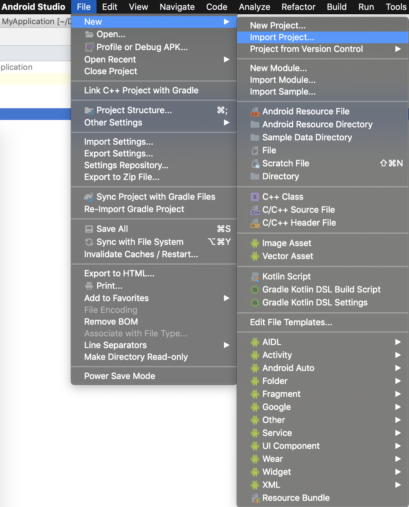

Step 5. You must get a dialog box asking for module path.

    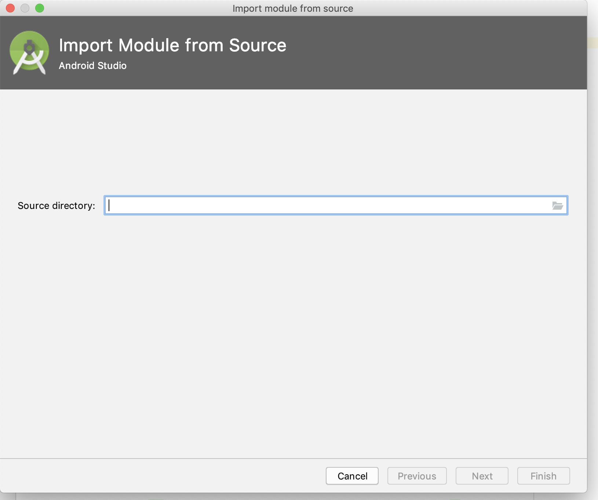

Step 6. Import OpenCV by navigating to the unzipped library (form step 1).
    Navigate to `./path/OpenCV-android-sdk/sdk/java`

    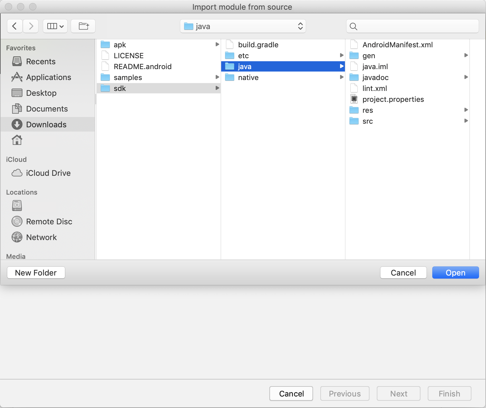

Step 7. After providing the path, the module is given the default name. Click next.

    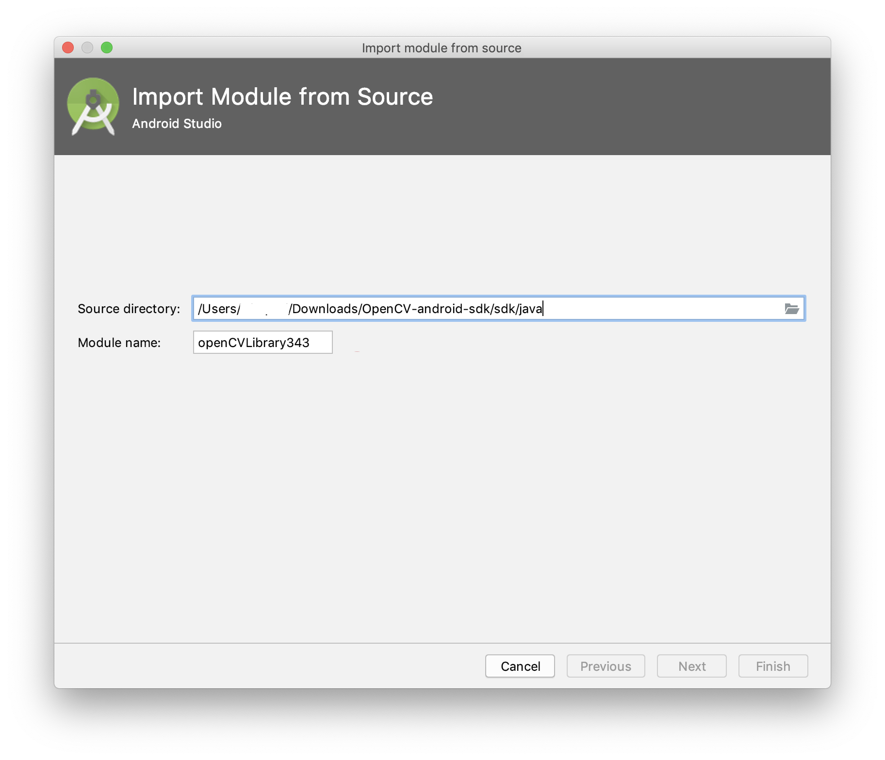

Step 8. Following screen appears after clicking next in the previous step. Click finish, to finish the importing process of OpenCV module.

    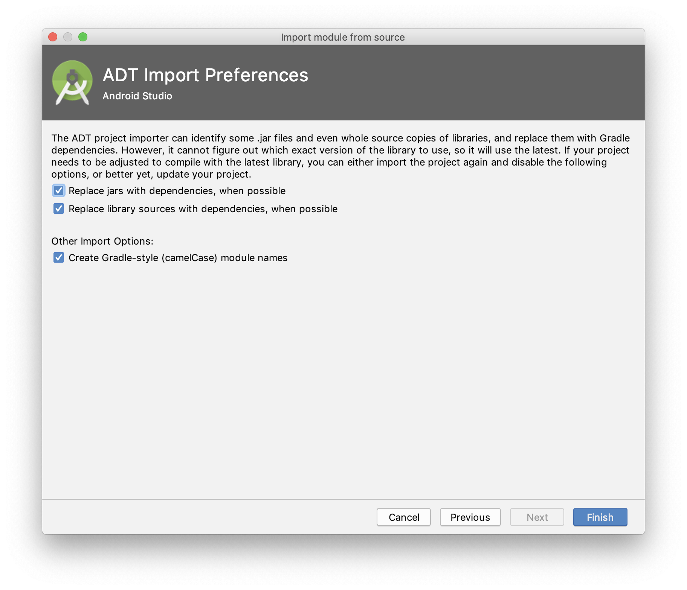

Step 9. Android Studio will take a while to complete the import process. Chances are that following errors occur after importing the OpenCV module.

    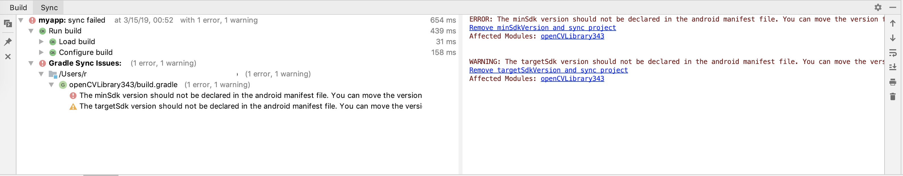

    Following steps will guide you through to fix the import errors.

Step 10. In the project navigation panel, firstly open the OpenCV gradle file which is shown below.

    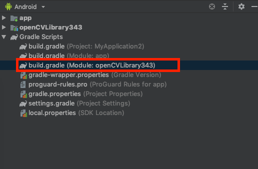

Step 11. The gradle file before fixing the erros might look something as shown below.

    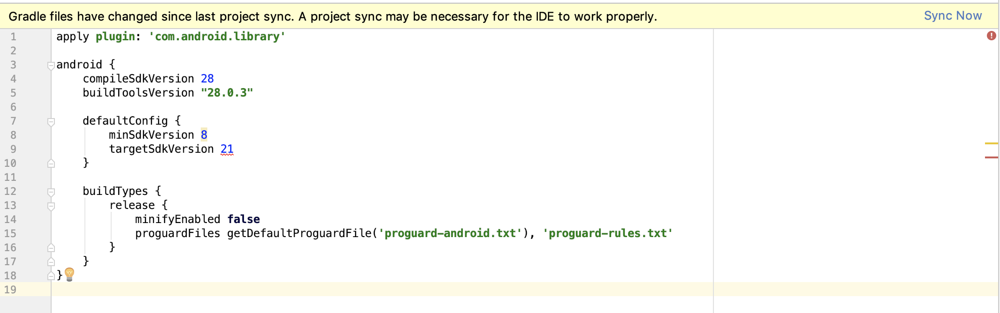

Step 12. Change the **targetSdkVersion** to match with the **compileSdkVersion**. An example is as follows:

    ```gradle
    apply plugin: 'com.android.library'

    android {
        compileSdkVersion 28
        buildToolsVersion "28.0.3"

        defaultConfig {
            minSdkVersion 8
            targetSdkVersion 28
        }

        buildTypes {
            release {
                minifyEnabled false
                proguardFiles getDefaultProguardFile('proguard-android.txt'), 'proguard-rules.txt'
            }
        }
    }
    ```

Step 13. After making the changes to the gradle file, navigate to the manifest file of OpenCV which in the location as shown below:

    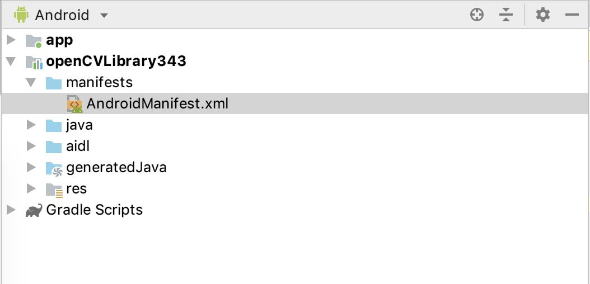

Step 14. Make changes to OpenCV manifest file by **removing** the `<uses-sdk android:minSdkVersion="8" android:targetSdkVersion="21" />` line. The final manifest file should look something as follows:

    ```XML
    <?xml version="1.0" encoding="utf-8"?>
    <manifest xmlns:android="http://schemas.android.com/apk/res/android"
        package="org.opencv"
        android:versionCode="3430"
        android:versionName="3.4.3">
    </manifest>
    ```

Step 15. Save all the changes and click on the sync now button which appears at the top as shown below:

    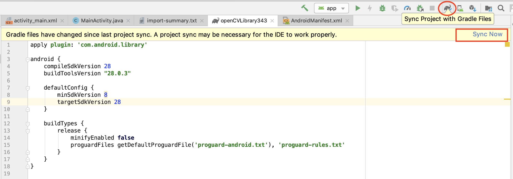

    You can also sync by clicking on the small elephant icon which is circled in the image.

Step 16. Add OpenCV dependency to the project. To do this, go to File --> Project Structure as shown below.

    (Shortcut for project structure in Mac is &#8984;+;)

    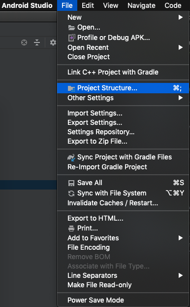

    You should see a dialog box as follows:

    Under modules section, click on app and click on dependencies. Then click on the + in the bottom and select module dependency (circled in red in above image).

    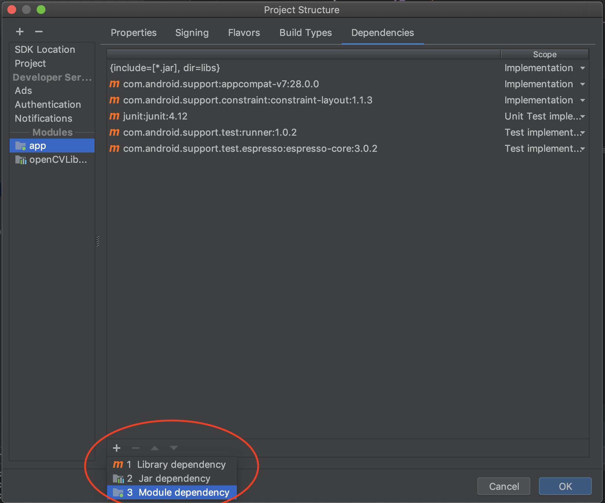

Step 17. After selecting the module dependency, the following dialog box should pop up. Select the OpenCV module which was imported in the previous steps.

    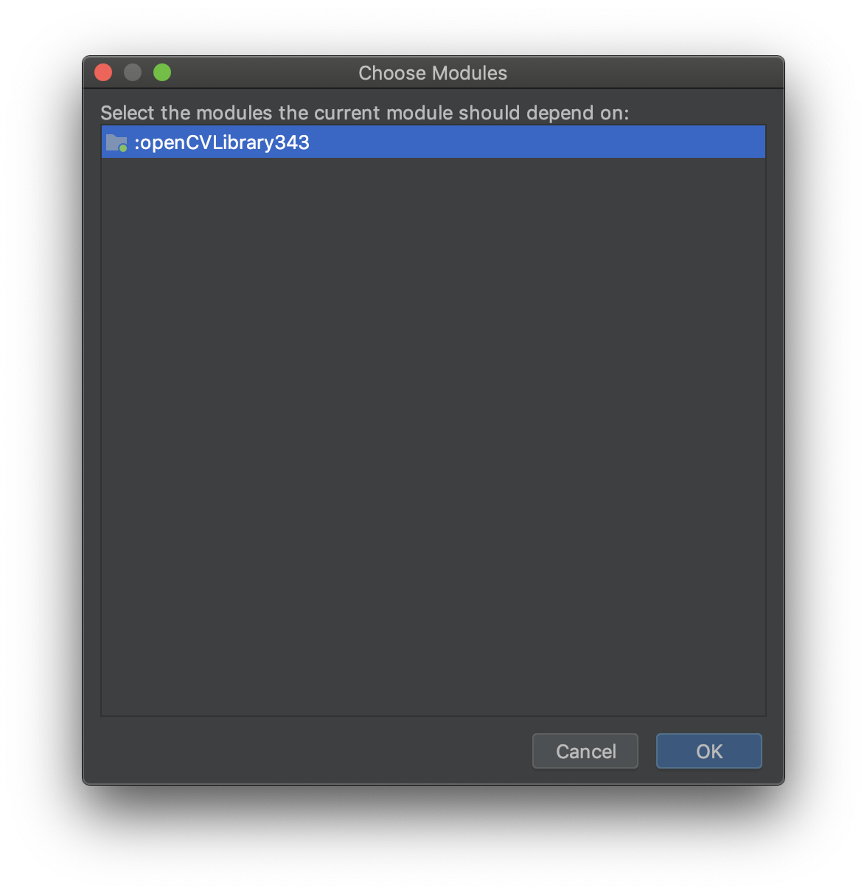

    After selecting the OpenCV module, the dependencies section in the project structure module should have the OpenCV listed as shown in image below.

    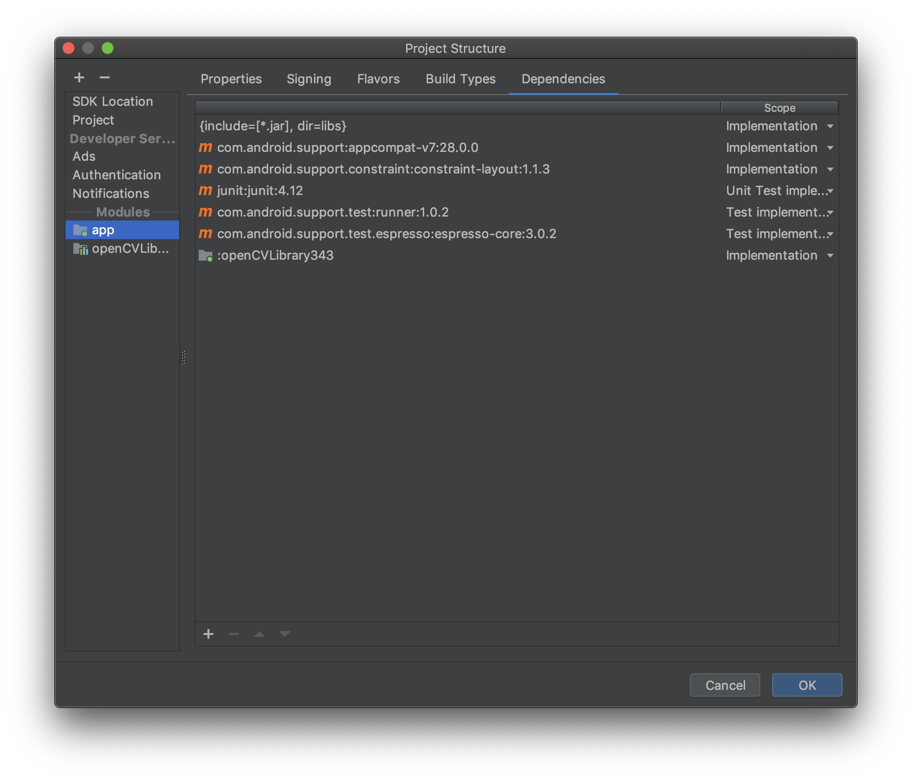

    Click ok and wait for the build to complete.

Step 18. Now open the OpenCV SDK folder which you downloaded and unzipped. Go to /OpenCV-android-sdk/sdk/native and then copy the `libs` folder

    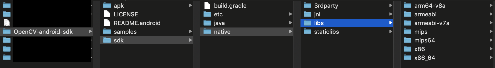

Step 19. Paste the `libs` folder copied from OpenCV SDK into your android project. To do this, navigate to your project folder in the `main` folder by navigating as follows: /project_parent_directory/project_folder/app/src/main/

    A example is shown below.

    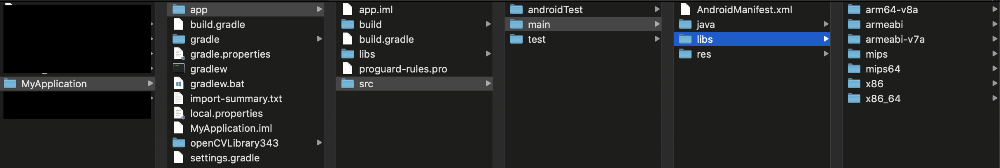

Step 20. Phew, last step! Rename the `libs` folder you pasted in the previous step as `jniLibs`.

    A example is shown below.

    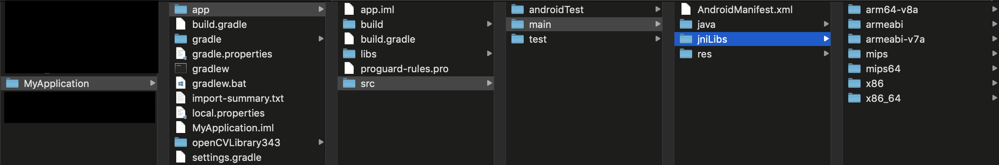

Now we are ready to build OpenCV applications on Android. Next section deals with a list of Demos using OpenCV on Android.

---

## List of Demos

Now let us get started with demos. Following are the list of demos which are available in this repository. Click on each of the demos to
