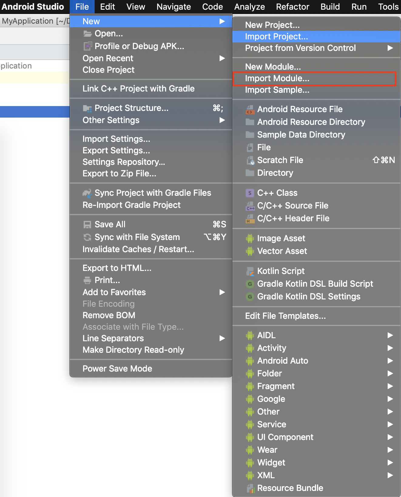

# Getting started with OpenCV in android

## Contents

1. [Setting up OpenCV in Android Studio](#setting-up-opencv-in-android-studio)
2. [List of Demos](#list-of-demos)

---
## Setting up OpenCV in Android Studio

1. [Download OpenCV 3.4.3 from official OpenCV Sourceforge page.](https://sourceforge.net/projects/opencvlibrary/files/opencv-android/)

2. Unzip the OpenCV library.

3. Create a new project in Android Studio using this [guide](../README.MD).

4. Import the OpenCV module: File --> New --> Import Module


5. You must get a dialog box asking for module path.


6. Import OpenCV by navigating to the unzipped library (form step 1).
Navigate to `./path/OpenCV-android-sdk/sdk/java`


7. After providing the path, the module is given the default name. Click next.


8. Following screen appears after clicking next in the previous step. Click finish, to finish the importing process of OpenCV module.


9. Android Studio will take a while to complete the import process. Chances are that following errors occur after importing the OpenCV module.


Following steps will guide you through to fix the import errors.

10. In the project navigation panel, firstly open the OpenCV gradle file which is shown below.


11. The gradle file before fixing the erros might look something as shown below.


12. Change the **targetSdkVersion** to match with the **compileSdkVersion**. An example is as follows:

```
apply plugin: 'com.android.library'

android {
    compileSdkVersion 28
    buildToolsVersion "28.0.3"

    defaultConfig {
        minSdkVersion 8
        targetSdkVersion 28
    }

    buildTypes {
        release {
            minifyEnabled false
            proguardFiles getDefaultProguardFile('proguard-android.txt'), 'proguard-rules.txt'
        }
    }
}
```

13. After making the changes to the gradle file, navigate to the manifest file of OpenCV which in the location as shown below:


14. Make changes to OpenCV manifest file by **removing** the `<uses-sdk android:minSdkVersion="8" android:targetSdkVersion="21" />` line. The final manifest file should look something as follows:

```XML
<?xml version="1.0" encoding="utf-8"?>
<manifest xmlns:android="http://schemas.android.com/apk/res/android"
      package="org.opencv"
      android:versionCode="3430"
      android:versionName="3.4.3">
</manifest>
```

15. Save all the changes and click on the sync now button which appears at the top as shown below:


You can also sync by clicking on the small elephant icon which is circled in the image.
You are done with setting up OpenCV.

---

## List of Demos
Now let us get started with demos. Following are the list of demos which are available in this repository. Click on each of the demos to
