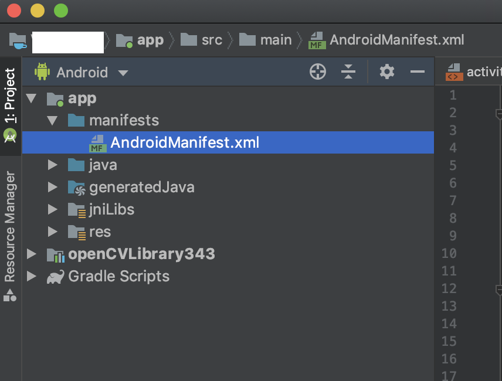

# Color Blob Detector

In this app demo, we are going to use OpenCV to detect color blobs in video frames in real time, highlight the blobs and display them on the app screen.

Before trying this example, please keep it in mind that, since there is no uniformity in the camera sensor orientation on all Android phones, depending on the phone you are trying this on, the orientation of the camera view in the app will change.

Firstly, create a new project named as `Color blob detector` in Android Studio. Then follow the steps to setup OpenCV for the project as shown [here](../README.md#setting-up-opencv-in-android-studio).

After setting up OpenCV, go to `AndroidManifest.xml` of the app as shown below.



Make the following changes to the `AndroidManifest.xml`. These changes will add the Camera access permission to the app. You need to go to Phone settings > App permissions > APP_NAME > Permissions and enable camera permission, so that app can access the camera.

```xml
<?xml version="1.0" encoding="utf-8"?>
<manifest xmlns:android="http://schemas.android.com/apk/res/android"
    package="com.example.colorblobdetector">

    <uses-permission android:name="android.permission.CAMERA"/>

    <uses-feature android:name="android.hardware.camera" android:required="false"/>
    <uses-feature android:name="android.hardware.camera.autofocus" android:required="false"/>
    <uses-feature android:name="android.hardware.camera.front" android:required="false"/>
    <uses-feature android:name="android.hardware.camera.front.autofocus" android:required="false"/>

    <application
        android:allowBackup="true"
        android:icon="@mipmap/ic_launcher"
        android:label="@string/app_name"
        android:roundIcon="@mipmap/ic_launcher_round"
        android:supportsRtl="true"
        android:theme="@style/AppTheme">
        <activity android:name=".MainActivity">
            <intent-filter>
                <action android:name="android.intent.action.MAIN" />

                <category android:name="android.intent.category.LAUNCHER" />
            </intent-filter>
        </activity>
    </application>

</manifest>
```

Make the following changes in the **activity_main.xml**.

```xml
<?xml version="1.0" encoding="utf-8"?>
<FrameLayout
    xmlns:android="http://schemas.android.com/apk/res/android"
    android:layout_width="match_parent"
    android:layout_height="match_parent" >

    <org.opencv.android.JavaCameraView
        android:layout_width="match_parent"
        android:layout_height="match_parent"
        android:id="@+id/color_blob_detection_activity_surface_view" />

</FrameLayout>
```

Make the following changes to the **MainActivity.java**.

```java
package com.example.colorblobdetector;

import java.util.List;
import org.opencv.android.BaseLoaderCallback;
import org.opencv.android.CameraBridgeViewBase.CvCameraViewFrame;
import org.opencv.android.LoaderCallbackInterface;
import org.opencv.android.OpenCVLoader;
import org.opencv.core.Core;
import org.opencv.core.CvType;
import org.opencv.core.Mat;
import org.opencv.core.MatOfPoint;
import org.opencv.core.Rect;
import org.opencv.core.Scalar;
import org.opencv.core.Size;
import org.opencv.android.CameraBridgeViewBase;
import org.opencv.android.CameraBridgeViewBase.CvCameraViewListener2;
import org.opencv.imgproc.Imgproc;
import android.app.Activity;
import android.os.Bundle;
import android.util.Log;
import android.view.MotionEvent;
import android.view.View;
import android.view.Window;
import android.view.WindowManager;
import android.view.View.OnTouchListener;
import android.view.SurfaceView;

public class MainActivity extends Activity implements OnTouchListener, CvCameraViewListener2 {
    private static final String  TAG              = "MainActivity";

    private boolean              mIsColorSelected = false;
    private Mat                  mRgba;
    private Scalar               mBlobColorRgba;
    private Scalar               mBlobColorHsv;
    private ColorBlobDetector    mDetector;
    private Mat                  mSpectrum;
    private Size                 SPECTRUM_SIZE;
    private Scalar               CONTOUR_COLOR;

    private CameraBridgeViewBase mOpenCvCameraView;

    private BaseLoaderCallback  mLoaderCallback = new BaseLoaderCallback(this) {
        @Override
        public void onManagerConnected(int status) {
            switch (status) {
                case LoaderCallbackInterface.SUCCESS:
                {
                    Log.i(TAG, "OpenCV loaded successfully");
                    mOpenCvCameraView.enableView();
                    mOpenCvCameraView.setOnTouchListener(MainActivity.this);
                } break;
                default:
                {
                    super.onManagerConnected(status);
                } break;
            }
        }
    };

    public MainActivity() {
        Log.i(TAG, "Instantiated new " + this.getClass());
    }

    /** Called when the activity is first created. */
    @Override
    public void onCreate(Bundle savedInstanceState) {
        Log.i(TAG, "called onCreate");
        super.onCreate(savedInstanceState);
        requestWindowFeature(Window.FEATURE_NO_TITLE);
        getWindow().addFlags(WindowManager.LayoutParams.FLAG_KEEP_SCREEN_ON);

        setContentView(R.layout.activity_main);

        mOpenCvCameraView = (CameraBridgeViewBase) findViewById(R.id.color_blob_detection_activity_surface_view);
        mOpenCvCameraView.setVisibility(SurfaceView.VISIBLE);
        mOpenCvCameraView.setCvCameraViewListener(this);
    }

    @Override
    public void onPause()
    {
        super.onPause();
        if (mOpenCvCameraView != null)
            mOpenCvCameraView.disableView();
    }

    @Override
    public void onResume()
    {
        super.onResume();
        if (!OpenCVLoader.initDebug()) {
            Log.d(TAG, "Internal OpenCV library not found. Using OpenCV Manager for initialization");
            OpenCVLoader.initAsync(OpenCVLoader.OPENCV_VERSION_3_0_0, this, mLoaderCallback);
        } else {
            Log.d(TAG, "OpenCV library found inside package. Using it!");
            mLoaderCallback.onManagerConnected(LoaderCallbackInterface.SUCCESS);
        }
    }

    public void onDestroy() {
        super.onDestroy();
        if (mOpenCvCameraView != null)
            mOpenCvCameraView.disableView();
    }

    public void onCameraViewStarted(int width, int height) {
        mRgba = new Mat(height, width, CvType.CV_8UC4);
        mDetector = new ColorBlobDetector();
        mSpectrum = new Mat();
        mBlobColorRgba = new Scalar(255);
        mBlobColorHsv = new Scalar(255);
        SPECTRUM_SIZE = new Size(200, 64);
        CONTOUR_COLOR = new Scalar(255,0,0,255);
    }

    public void onCameraViewStopped() {
        mRgba.release();
    }

    public boolean onTouch(View v, MotionEvent event) {
        int cols = mRgba.cols();
        int rows = mRgba.rows();

        int xOffset = (mOpenCvCameraView.getWidth() - cols) / 2;
        int yOffset = (mOpenCvCameraView.getHeight() - rows) / 2;

        int x = (int)event.getX() - xOffset;
        int y = (int)event.getY() - yOffset;

        Log.i(TAG, "Touch image coordinates: (" + x + ", " + y + ")");

        if ((x < 0) || (y < 0) || (x > cols) || (y > rows)) return false;

        Rect touchedRect = new Rect();

        touchedRect.x = (x>4) ? x-4 : 0;
        touchedRect.y = (y>4) ? y-4 : 0;

        touchedRect.width = (x+4 < cols) ? x + 4 - touchedRect.x : cols - touchedRect.x;
        touchedRect.height = (y+4 < rows) ? y + 4 - touchedRect.y : rows - touchedRect.y;

        Mat touchedRegionRgba = mRgba.submat(touchedRect);

        Mat touchedRegionHsv = new Mat();
        Imgproc.cvtColor(touchedRegionRgba, touchedRegionHsv, Imgproc.COLOR_RGB2HSV_FULL);

        // Calculate average color of touched region
        mBlobColorHsv = Core.sumElems(touchedRegionHsv);
        int pointCount = touchedRect.width*touchedRect.height;
        for (int i = 0; i < mBlobColorHsv.val.length; i++)
            mBlobColorHsv.val[i] /= pointCount;

        mBlobColorRgba = converScalarHsv2Rgba(mBlobColorHsv);

        Log.i(TAG, "Touched rgba color: (" + mBlobColorRgba.val[0] + ", " + mBlobColorRgba.val[1] +
                ", " + mBlobColorRgba.val[2] + ", " + mBlobColorRgba.val[3] + ")");

        mDetector.setHsvColor(mBlobColorHsv);

        Imgproc.resize(mDetector.getSpectrum(), mSpectrum, SPECTRUM_SIZE, 0, 0, Imgproc.INTER_LINEAR_EXACT);

        mIsColorSelected = true;

        touchedRegionRgba.release();
        touchedRegionHsv.release();

        return false; // don't need subsequent touch events
    }

    public Mat onCameraFrame(CvCameraViewFrame inputFrame) {
        mRgba = inputFrame.rgba();

        if (mIsColorSelected) {
            mDetector.process(mRgba);
            List<MatOfPoint> contours = mDetector.getContours();
            Log.e(TAG, "Contours count: " + contours.size());
            Imgproc.drawContours(mRgba, contours, -1, CONTOUR_COLOR);

            Mat colorLabel = mRgba.submat(4, 68, 4, 68);
            colorLabel.setTo(mBlobColorRgba);

            Mat spectrumLabel = mRgba.submat(4, 4 + mSpectrum.rows(), 70, 70 + mSpectrum.cols());
            mSpectrum.copyTo(spectrumLabel);
        }

        return mRgba;
    }

    private Scalar converScalarHsv2Rgba(Scalar hsvColor) {
        Mat pointMatRgba = new Mat();
        Mat pointMatHsv = new Mat(1, 1, CvType.CV_8UC3, hsvColor);
        Imgproc.cvtColor(pointMatHsv, pointMatRgba, Imgproc.COLOR_HSV2RGB_FULL, 4);

        return new Scalar(pointMatRgba.get(0, 0));
    }
}
```

Now create a new java file named `ColorBlobDetector.java` to write the color blob detection code.

```java
package com.example.colorblobdetector;

import java.util.ArrayList;
import java.util.Iterator;
import java.util.List;

import org.opencv.core.Core;
import org.opencv.core.CvType;
import org.opencv.core.Mat;
import org.opencv.core.MatOfPoint;
import org.opencv.core.Scalar;
import org.opencv.imgproc.Imgproc;

public class ColorBlobDetector {
    // Lower and Upper bounds for range checking in HSV color space
    private Scalar mLowerBound = new Scalar(0);
    private Scalar mUpperBound = new Scalar(0);
    // Minimum contour area in percent for contours filtering
    private static double mMinContourArea = 0.1;
    // Color radius for range checking in HSV color space
    private Scalar mColorRadius = new Scalar(25,50,50,0);
    private Mat mSpectrum = new Mat();
    private List<MatOfPoint> mContours = new ArrayList<MatOfPoint>();

    // Cache
    Mat mPyrDownMat = new Mat();
    Mat mHsvMat = new Mat();
    Mat mMask = new Mat();
    Mat mDilatedMask = new Mat();
    Mat mHierarchy = new Mat();

    public void setColorRadius(Scalar radius) {
        mColorRadius = radius;
    }

    public void setHsvColor(Scalar hsvColor) {
        double minH = (hsvColor.val[0] >= mColorRadius.val[0]) ? hsvColor.val[0]-mColorRadius.val[0] : 0;
        double maxH = (hsvColor.val[0]+mColorRadius.val[0] <= 255) ? hsvColor.val[0]+mColorRadius.val[0] : 255;

        mLowerBound.val[0] = minH;
        mUpperBound.val[0] = maxH;

        mLowerBound.val[1] = hsvColor.val[1] - mColorRadius.val[1];
        mUpperBound.val[1] = hsvColor.val[1] + mColorRadius.val[1];

        mLowerBound.val[2] = hsvColor.val[2] - mColorRadius.val[2];
        mUpperBound.val[2] = hsvColor.val[2] + mColorRadius.val[2];

        mLowerBound.val[3] = 0;
        mUpperBound.val[3] = 255;

        Mat spectrumHsv = new Mat(1, (int)(maxH-minH), CvType.CV_8UC3);

        for (int j = 0; j < maxH-minH; j++) {
            byte[] tmp = {(byte)(minH+j), (byte)255, (byte)255};
            spectrumHsv.put(0, j, tmp);
        }

        Imgproc.cvtColor(spectrumHsv, mSpectrum, Imgproc.COLOR_HSV2RGB_FULL, 4);
    }

    public Mat getSpectrum() {
        return mSpectrum;
    }

    public void setMinContourArea(double area) {
        mMinContourArea = area;
    }

    public void process(Mat rgbaImage) {
        Imgproc.pyrDown(rgbaImage, mPyrDownMat);
        Imgproc.pyrDown(mPyrDownMat, mPyrDownMat);

        Imgproc.cvtColor(mPyrDownMat, mHsvMat, Imgproc.COLOR_RGB2HSV_FULL);

        Core.inRange(mHsvMat, mLowerBound, mUpperBound, mMask);
        Imgproc.dilate(mMask, mDilatedMask, new Mat());

        List<MatOfPoint> contours = new ArrayList<MatOfPoint>();

        Imgproc.findContours(mDilatedMask, contours, mHierarchy, Imgproc.RETR_EXTERNAL, Imgproc.CHAIN_APPROX_SIMPLE);

        // Find max contour area
        double maxArea = 0;
        Iterator<MatOfPoint> each = contours.iterator();
        while (each.hasNext()) {
            MatOfPoint wrapper = each.next();
            double area = Imgproc.contourArea(wrapper);
            if (area > maxArea)
                maxArea = area;
        }

        // Filter contours by area and resize to fit the original image size
        mContours.clear();
        each = contours.iterator();
        while (each.hasNext()) {
            MatOfPoint contour = each.next();
            if (Imgproc.contourArea(contour) > mMinContourArea*maxArea) {
                Core.multiply(contour, new Scalar(4,4), contour);
                mContours.add(contour);
            }
        }
    }

    public List<MatOfPoint> getContours() {
        return mContours;
    }
}
```

If you have followed all the steps correctly, you will be able to see camera preview with color blobs highlighted whenever you click in a particular color.
