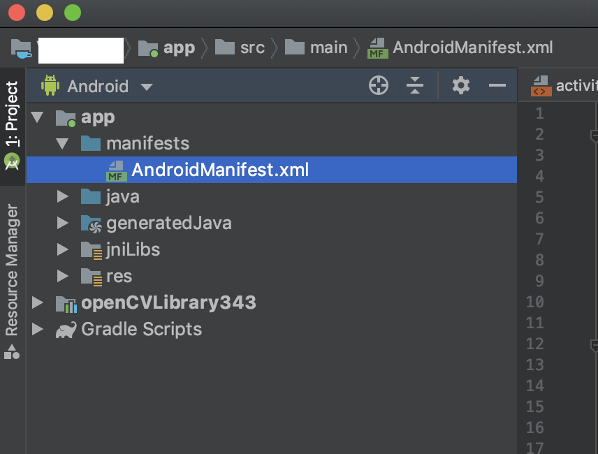

# OpenCV Camera

In this app demo, we are going to use OpenCV to open camera and display the frames on the app screen.

Before trying this example, please keep it in mind that, since there is no uniformity in the camera sensor orientation on all Android phones, depending on the phone you are trying this on, the orientation of the camera view in the app will change.

Firstly, create a new project named as `OpenCV Camera` in Android Studio. Then follow the steps to setup OpenCV for the project as shown [here](../README.md#setting-up-opencv-in-android-studio).

After setting up OpenCV, go to `AndroidManifest.xml` of the app as shown below.



Make the following changes to the `AndroidManifest.xml`. These changes will add the Camera access permission to the app. You need to go to Phone settings > App permissions > APP_NAME > Permissions and enable camera permission, so that app can access the camera.

```xml
<?xml version="1.0" encoding="utf-8"?>
<manifest xmlns:android="http://schemas.android.com/apk/res/android"
    package="com.example.opencvcamera">

    <uses-permission android:name="android.permission.CAMERA"/>

    <uses-feature android:name="android.hardware.camera" android:required="false"/>
    <uses-feature android:name="android.hardware.camera.autofocus" android:required="false"/>
    <uses-feature android:name="android.hardware.camera.front" android:required="false"/>
    <uses-feature android:name="android.hardware.camera.front.autofocus" android:required="false"/>

    <application
        android:allowBackup="true"
        android:icon="@mipmap/ic_launcher"
        android:label="@string/app_name"
        android:roundIcon="@mipmap/ic_launcher_round"
        android:supportsRtl="true"
        android:theme="@style/AppTheme">
        <activity android:name=".MainActivity">
            <intent-filter>
                <action android:name="android.intent.action.MAIN" />

                <category android:name="android.intent.category.LAUNCHER" />
            </intent-filter>
        </activity>
    </application>

</manifest>
```

Make the following changes in the **activity_main.xml**.

```xml
<?xml version="1.0" encoding="utf-8"?>
<FrameLayout xmlns:android="http://schemas.android.com/apk/res/android"
    android:layout_width="match_parent"
    android:layout_height="match_parent"
    xmlns:app="http://schemas.android.com/apk/res-auto">

    <org.opencv.android.JavaCameraView
        android:layout_width="match_parent"
        android:layout_height="match_parent"
        android:id="@+id/camera_activity_surface_view"
        app:show_fps="true"/>

</FrameLayout>
```

Make the following changes to the **MainActivity.java**.

```java
package com.example.opencvcamera;

import android.support.v7.app.AppCompatActivity;
import android.os.Bundle;
import android.util.Log;
import android.view.SurfaceView;
import android.view.Window;
import android.view.WindowManager;

import org.opencv.android.BaseLoaderCallback;
import org.opencv.android.CameraBridgeViewBase;
import org.opencv.android.LoaderCallbackInterface;
import org.opencv.android.OpenCVLoader;
import org.opencv.core.Core;
import org.opencv.core.CvType;
import org.opencv.core.Mat;
import org.opencv.imgproc.Imgproc;

public class MainActivity extends AppCompatActivity implements CameraBridgeViewBase.CvCameraViewListener2 {

    private static final String TAG = "MainActivity";
    private CameraBridgeViewBase mOpenCvCameraView;
    Mat mRgba;

    public MainActivity() {
        Log.i(TAG, "Instantiated new " + this.getClass());
    }

    @Override
    protected void onCreate(Bundle savedInstanceState) {
        super.onCreate(savedInstanceState);
        requestWindowFeature(Window.FEATURE_NO_TITLE);
        getWindow().addFlags(WindowManager.LayoutParams.FLAG_KEEP_SCREEN_ON);

        setContentView(R.layout.activity_main);

        mOpenCvCameraView = (CameraBridgeViewBase) findViewById(R.id.camera_activity_surface_view);
        mOpenCvCameraView.setVisibility(SurfaceView.VISIBLE);
        mOpenCvCameraView.setCvCameraViewListener(this);
    }

    private BaseLoaderCallback mLoaderCallback = new BaseLoaderCallback(this) {
        @Override
        public void onManagerConnected(int status) {
            switch (status) {
                case LoaderCallbackInterface.SUCCESS: {
                    Log.i(TAG, "OpenCV loaded successfully");
                    mOpenCvCameraView.enableView();
                }
                break;
                default: {
                    super.onManagerConnected(status);
                }
                break;
            }
        }
    };

    @Override
    public void onCameraViewStarted(int width, int height) {
        mRgba = new Mat(height, width, CvType.CV_8UC4);
    }

    @Override
    public void onCameraViewStopped() {

    }

    @Override
    public Mat onCameraFrame(CameraBridgeViewBase.CvCameraViewFrame inputFrame) {
        // Opencv camera shows mirrored video frames
        // So flip frames using following code
        mRgba = inputFrame.rgba();
        Core.flip(mRgba, mRgba, 0);
        Core.flip(mRgba, mRgba, 1);

        return mRgba;
    }

    @Override
    public void onPause() {
        super.onPause();
        if (mOpenCvCameraView != null)
            mOpenCvCameraView.disableView();
    }

    @Override
    public void onResume() {
        super.onResume();
        if (!OpenCVLoader.initDebug()) {
            Log.d(TAG, "Internal OpenCV library not found. Using OpenCV Manager for initialization");
            OpenCVLoader.initAsync(OpenCVLoader.OPENCV_VERSION_3_0_0, this, mLoaderCallback);
        } else {
            Log.d(TAG, "OpenCV library found inside package. Using it!");
            mLoaderCallback.onManagerConnected(LoaderCallbackInterface.SUCCESS);
        }
    }

    public void onDestroy() {
        super.onDestroy();
        if (mOpenCvCameraView != null)
            mOpenCvCameraView.disableView();
    }
}
```

If you have followed all the steps correctly, you should be able to see an app screen with camera preview.
