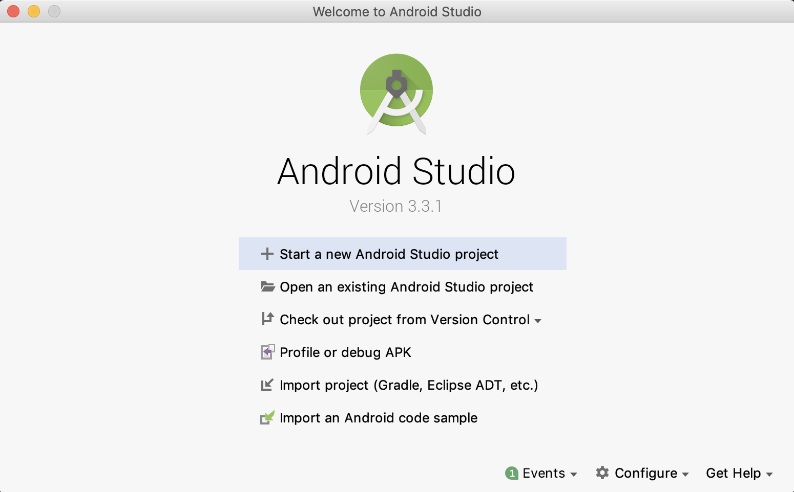
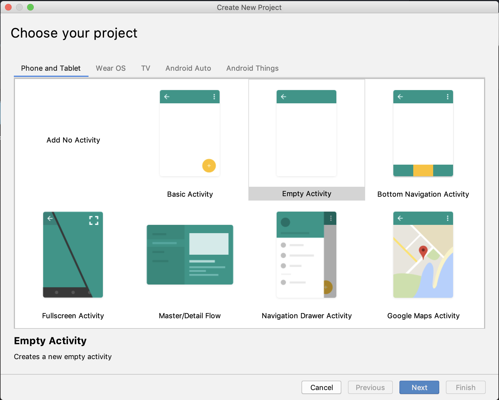
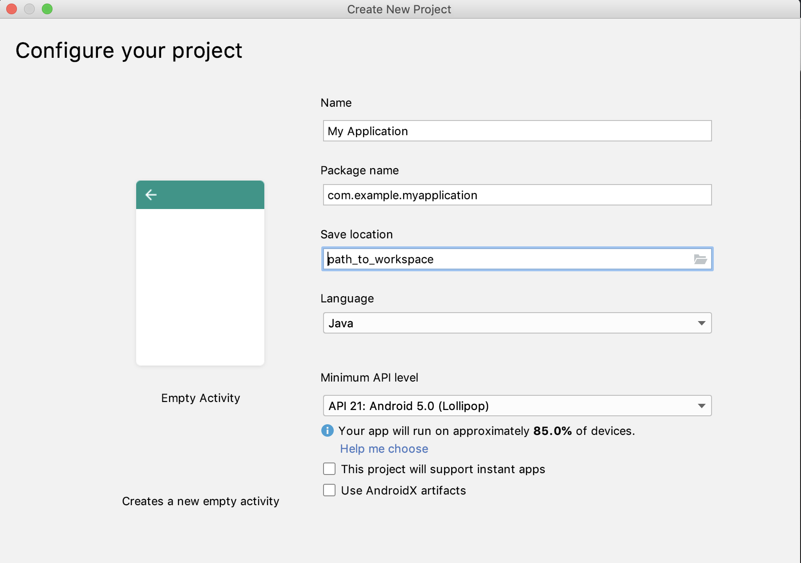
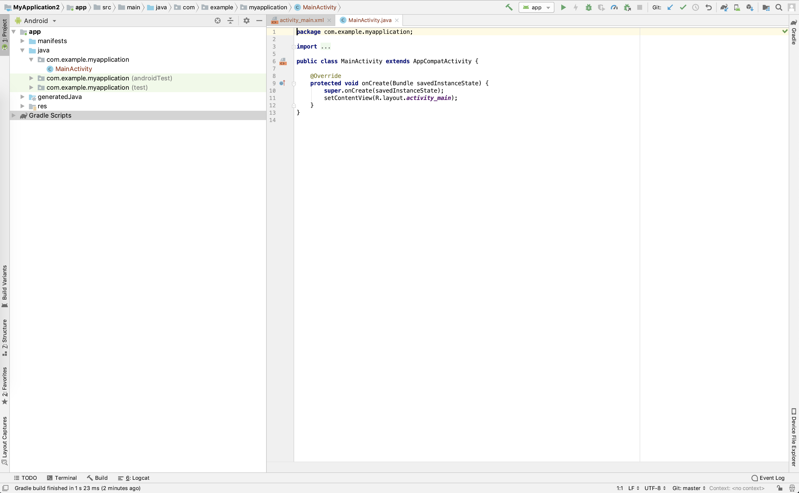
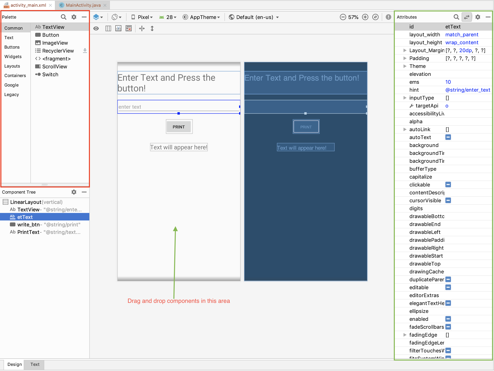

# Android Basics
### Role of `Java` and `XML` in Android.
1. `XML` (eXtensible Markup Language): `XML` is used for declaring and defining layouts in android. It can be said that `XML` defines how the UI looks like for the application you are developing. Each element in the `XML` layout has an unique 'id' which can be used to

2. `Java`: `Java` is used to write the logic for the application. This logic can control the actions that take place when user interacts with the application also data is processed using Java code.

---

# Getting started with Android Application Development

1. [Download Android Studio.](https://developer.android.com/studio/index.html)
2. Follow the on-screen instructions to install the Android Studio.

---

### Creating a new Empty Android Project
Open Android Studio, and follow the following images to create an empty project.

1. Welcome Screen of Android Studio.


2. Choose the project from the list of available templates.


3. Configure your project by specifying the project name, your workspace location, minimum API level etc.


4. Give it a minute or two to build the project. (The build process can be seen on the right bottom part of Android Studio).

5. If the build was successful, you'll see the following screen without any errors:



---

# Building the UI
In Android Studio, UI can built using the Layout Editor, `XML` code or both.

## [Layout Editor](https://developer.android.com/studio/write/layout-editor)

Most part for Android UI for basic apps can be done using the drag and drop feature in Android Studio Layout Editor.

Palette (marked in red box) contains all the basic components that can be used to build the UI. Each component can be dragged and dropped to the Design Editor. Each component's attributes can be set and unset using the attributes control marked in green box).


### Simple Text Edit demo

Use the code provided in the TextEditDemo. Following snippet explain what the `java` and `XML` code is doing.

**activity_main.XML**

Each component of the UI can be assigned attributes such as the layout_width, layout_height etc. using the `XML` code instead of using the drag and drop feature. This method provides more flexibility and control over how the components are placed in the UI as compared to the drag and drop.

```XML
<TextView
    android:layout_width="wrap_content"
    android:layout_height="wrap_content"
    android:layout_marginTop="30dp"
    android:text="Enter Text and \nPress the button!"
    android:textSize="30dp" />
<EditText
    android:id="@+id/etText"
    android:layout_width="match_parent"
    android:layout_height="wrap_content"
    android:layout_marginTop="20dp"
    android:ems="10"
    android:hint="enter text" >
</EditText>

<Button
    android:id="@+id/write_btn"
    android:layout_width="wrap_content"
    android:layout_height="wrap_content"
    android:layout_marginTop="20dp"
    android:text="Print"
    />
<TextView
    android:id="@+id/PrintText"
    android:layout_width="wrap_content"
    android:layout_height="wrap_content"
    android:layout_marginTop="30dp"
    android:text="Text will appear here!"
    android:textSize="20dp"
    />
```

**MainActivity.java**

```java
EditText TextInput; // create an object of EditText class -- this is the object which is used to get the user input
TextView TextOutput; // create an object of TextView class -- this is the object which is used to display the output text in the screen
Button writebtn; // create an object of Button class -- this object is used to define actions to take place when user interacts with the button

@Override // annotation which indicates that a method declaration is intended to override a method declaration in a supertype
protected void onCreate(Bundle savedInstanceState) { // this is the first function that is called when the activity is initialized. Usually setContentView(int) is called here followed by other initializations.
    super.onCreate(savedInstanceState);
    setContentView(R.layout.activity_main); // set the layout resource defining your UI
    // Use findViewById to retrieve the widgets in that UI that you need to interact with programmatically.
    TextInput = (EditText) findViewById(R.id.etText);
    TextOutput = (TextView) findViewById(R.id.PrintText);
    writebtn = (Button) findViewById(R.id.write_btn);
    writebtn.setOnClickListener(this); // use setOnClickListener method to listen to user interaction with the button
}

@Override
public void onClick(View v){
    // TODO Auto-generated method stub
    TextOutput.setText(TextInput.getText()); // use setText(String) method to display text on the screen
}
```

---

# Android activity life cycle

Following image shows the various callback methods that can be implemented to perform actions during different states of an activity.


