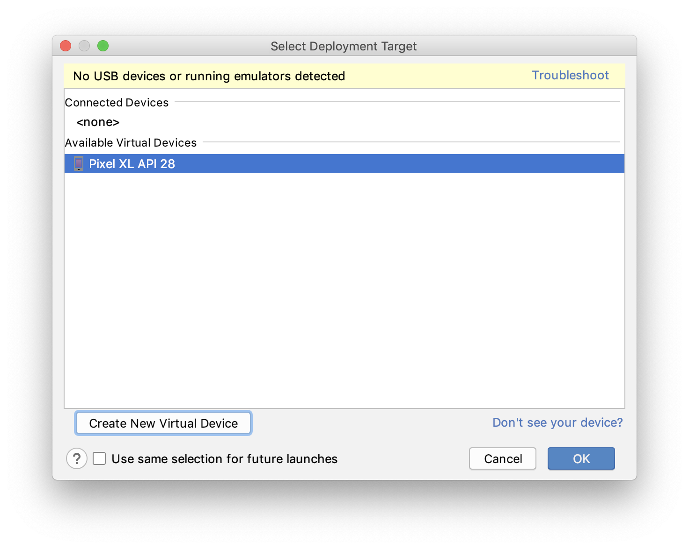

# DSP Lab Android Demos

This is the repository for Android demos for the [EL-GY 6183 Digital Signal Processing Laboratory](http://bulletin.engineering.nyu.edu/preview_course_nopop.php?catoid=9&coid=24134) taught by [Professor Ivan Selesnick](http://eeweb.poly.edu/iselesni/) at NYU Tandon School of Engineering.

## Contents

1. [Java Basics](./Java_Demos/JavaBasics.md)
2. [Android Basics](#android-basics)
3. [Getting started with Android Application Development](#getting-started-with-android-application-development)
4. [Creating a new Empty Android Project](#creating-a-new-empty-android-project)
5. [Creating an emulator in Android Studio to run android apps](#creating-an-emulator-in-android-studio-to-run-android-apps)
6. [Building the UI](#building-the-ui)
8. [Android activity life cycle](#android-activity-life-cycle)
9. [OpenCV for Android](#opencv)

---

## Android Basics

### Role of `Java` and `XML` in Android

1. `XML` (eXtensible Markup Language): `XML` is used for declaring and defining layouts in android. It can be said that `XML` defines how the UI looks like for the application you are developing. Each element in the `XML` layout has an unique 'id' which can be used to

2. `Java`: `Java` is used to write the logic for the application. This logic can control the actions that take place when user interacts with the application also data is processed using Java code.

Continue with Android Programming Basics [here](./Java_Demos/JavaBasics.md#java-for-android-development).

---

### Getting started with Android Application Development

1. [Download Android Studio.](https://developer.android.com/studio/index.html)
2. Follow the on-screen instructions to install the Android Studio.

---

### Creating a new Empty Android Project

Open Android Studio, and follow the following images to create an empty project.

1. Welcome Screen of Android Studio.

2. Choose the project from the list of available templates.

3. Configure your project by specifying the project name, your workspace location, minimum API level etc.

4. Give it a minute or two to build the project. (The build process can be seen on the right bottom part of Android Studio).

5. If the build was successful, you'll see the following screen without any errors:

---

## Creating an emulator in Android Studio to run android apps

If you do not have an Android phone to run the apps you develop, you can try to run them on the Emulator. But the emulator has limited functionalities.

1. Click on the Run app button in android studio (shown below in red).

2. You must see the following dialog box.

    Click on `Create New Virtual Device`

3. In the next screen select the Android phone on which you wish to run the apps.

4. On the next screen select the android version which should be emulated.
(Download android images if they were not downloaded before)

5. In the following screen give the  emulator a name and select other configurations and click on finish.

6. Select the created emulator in the screen shown below and click on ok.

7. After the emulator is selected in previous step, a virtual Android device pops up and starts to boot. After the boot process is over you can see you app open up automatically. A Hello World app on emulator should appear similar to the image below.

---

## Building the UI

In Android Studio, UI can built using the Layout Editor, `XML` code or both.

## [Layout Editor](https://developer.android.com/studio/write/layout-editor)

Most part for Android UI for basic apps can be done using the drag and drop feature in Android Studio Layout Editor.

Palette (marked in red box) contains all the basic components that can be used to build the UI. Each component can be dragged and dropped to the Design Editor. Each component's attributes can be set and unset using the attributes control marked in green box).

---

## Android activity life cycle

Following image shows the various callback methods that can be implemented to perform actions during different states of an activity.

### Use Log (as explained [here](./Java_Demos/JavaBasics.md#))statements to verify this activity lifecycle

---

Following are the list of demos available in this repository. Each demo has a readme and well commented code.
(Click on the links of each demo for README)

- [Text Edit Demo](./Android_Demos/Text_Edit_Demo/README.md)
- [Text Image Demo](./Android_Demos/Text_Image_Demo/README.md)
- [Slider Demo](./Android_Demos/Slider_Demo/README.md)
- [Sine Wave Demo 1](./Android_Demos/Sine_Wave_Demo1/README.md)
- [Sine Wave Demo 2](./Android_Demos/Sine_Wave_Demo2/README.md)
- [Sine Wave Demo 3](./Android_Demos/Sine_Wave_Demo3/README.md)
- [Sine Wave Demo 4](./Android_Demos/Sine_Wave_Demo4/README.md)
- [Accelerometer Audio](./Android_Demos/Accelerometer_Sine_Wave/README.md)

---

## OpenCV

[OpenCV setup](./OpenCV/README.md)

// TODO opencv demos
